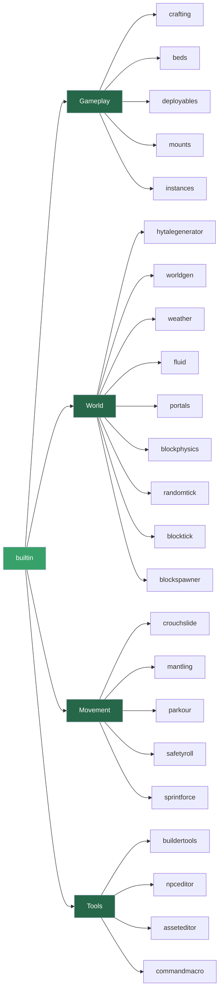
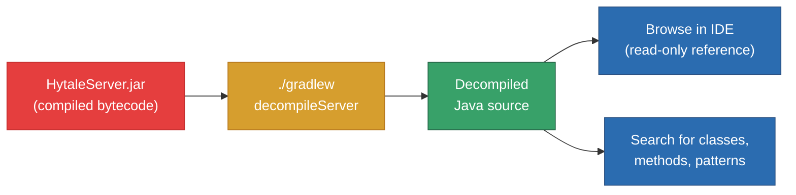

import { Aside, FileTree, Steps } from '@astrojs/starlight/components';

# Extracting & Decompiling the Server

The Hytale server JAR is compiled Java bytecode, but with the right tooling you can decompile it back into readable source. This decompiled output is the single most valuable reference you have as a plugin developer — it shows you every class, method, event, and system that exists, exactly as Hypixel wrote it.

## Why Decompile?

The official API surface is only part of the picture. Decompiling the server lets you:

- **See real implementations** of systems like ECS, commands, and events
- **Discover undocumented features** that are available but not yet covered in guides
- **Understand method signatures** and parameter types when the docs fall short
- **Study the builtin plugins** that ship with the server as working examples

<Aside type="tip" title="Learning by reading">
The builtin plugins (crafting, weather, portals, world generation, etc.) are full working examples of the same API you use to write your own plugins. Reading them is the fastest way to learn advanced patterns.
</Aside>

## Prerequisites

- The [official Hytale template project](https://github.com/Hytale) cloned and working
- Java 21 installed (see [Setup Guide](/getting-started/setup/))
- Gradle 8.0+ (bundled with the template via the Gradle wrapper)

## Decompiling the Server

<Steps>
1. Open a terminal in the root of the template project

2. Run the decompile task:
   ```bash
   ./gradlew decompileServer
   ```

3. Wait for the process to complete — this can take a minute or two depending on your machine

4. Find the extracted source in the output directory within the project
</Steps>

<Aside type="caution">
The decompiled source is for **learning and reference only**. Do not redistribute it. The code belongs to Hypixel Studios.
</Aside>

## What You Get

The decompiler produces a full Java source tree rooted at `com.hypixel.hytale`. Here is what the top-level package structure looks like:

```mermaid
graph TD
    ROOT["com.hypixel.hytale"]

    ROOT --> SERVER["server"]
    ROOT --> COMPONENT["component"]
    ROOT --> EVENT["event"]
    ROOT --> CODEC["codec"]
    ROOT --> REGISTRY["registry"]
    ROOT --> BUILTIN["builtin"]
    ROOT --> MATH["math"]
    ROOT --> PROTOCOL["protocol"]
    ROOT --> COMMON["common"]
    ROOT --> PLUGIN["plugin"]
    ROOT --> PROCEDURAL["procedurallib"]
    ROOT --> OTHER["storage / function / logger / ..."]

    style ROOT fill:#2d3748,stroke:#a0aec0,color:#fff
    style SERVER fill:#2b6cb0,stroke:#a0aec0,color:#fff
    style COMPONENT fill:#2b6cb0,stroke:#a0aec0,color:#fff
    style EVENT fill:#2b6cb0,stroke:#a0aec0,color:#fff
    style CODEC fill:#2b6cb0,stroke:#a0aec0,color:#fff
    style BUILTIN fill:#38a169,stroke:#a0aec0,color:#fff
    style REGISTRY fill:#2b6cb0,stroke:#a0aec0,color:#fff
    style MATH fill:#718096,stroke:#a0aec0,color:#fff
    style PROTOCOL fill:#718096,stroke:#a0aec0,color:#fff
    style COMMON fill:#718096,stroke:#a0aec0,color:#fff
    style PLUGIN fill:#2b6cb0,stroke:#a0aec0,color:#fff
    style PROCEDURAL fill:#718096,stroke:#a0aec0,color:#fff
    style OTHER fill:#4a5568,stroke:#a0aec0,color:#fff
```



**Blue** = packages you will interact with constantly as a plugin developer.
**Green** = the builtin plugins — your best learning resource.
**Gray** = internal/utility packages you may occasionally reference.

## Navigating the Source

### The `server.core` Package — Your Main API Surface

This is where the bulk of the modding API lives. Here is a breakdown:

<FileTree>
- com/hypixel/hytale/server/core/
  - plugin/            Plugin base classes (JavaPlugin, JavaPluginInit)
  - command/           Command system and argument types
  - event/             Server-side event definitions
  - entity/            Entity types and components
  - universe/          Worlds, chunks, players, block access
  - inventory/         Inventory and item systems
  - blocktype/         Block type definitions and properties
  - permissions/       Permission nodes and checks
  - registry/          Server registries for blocks, items, entities
  - prefab/            Prefab (template) system
  - ui/                Server-driven UI
  - config/            Server configuration
  - util/              Utility classes (Config, helpers)
  - task/              Scheduled and async task system
  - asset/             Asset loading and management
  - auth/              Authentication
  - cosmetics/         Cosmetic system
  - modules/           Server module system
</FileTree>

### The `builtin` Package — Working Plugin Examples

Every subdirectory in `builtin` is a self-contained plugin that ships with the server. These are real, production code:



<Aside type="tip" title="Start here">
If you want to learn how to register commands, look at `buildertools` or `commandmacro`. For event handling patterns, `crafting` and `beds` are great references. For world generation, start with `hytalegenerator`.
</Aside>

### The `component` Package — ECS Foundation

Hytale uses an Entity Component System. The `component` package defines the core ECS primitives:

<FileTree>
- com/hypixel/hytale/component/
  - data/              Component data types
  - dependency/        Dependency injection for systems
  - event/             ECS-level events
  - query/             Entity queries and filters
  - spatial/           Spatial indexing (collision, proximity)
  - system/            System base classes and scheduling
  - task/              ECS task system
  - metric/            Performance metrics
  - Ref.java           Entity reference handle
  - Store.java         Component data store
</FileTree>

### The `codec` Package — Serialization

The codec system handles all serialization and deserialization (configs, network, persistence):

<FileTree>
- com/hypixel/hytale/codec/
  - builder/           BuilderCodec for defining serializable types
  - codecs/            Built-in codec implementations
  - schema/            Schema validation
  - store/             Storage-backed codecs
  - Codec.java         Core Codec interface
  - KeyedCodec.java    Named field codec
</FileTree>

### Other Notable Packages

| Package | Purpose |
|---------|---------|
| `event` | Base event system interfaces (`EventPriority`, `EventRegistry`) |
| `registry` | Type-safe registry system for game objects |
| `math` | Vectors, raycasting, hit detection, shapes, block math |
| `protocol` | Network packets and I/O |
| `procedurallib` | Procedural generation library (conditions, logic, randomness) |
| `common` | Shared utilities (collections, threading, semver) |
| `plugin` | Low-level plugin loading and early initialization |

## The Decompilation Workflow

Here is how the full workflow fits together, from server JAR to your IDE:



## Tips for Exploring

**Use your IDE's search.** Once the source is extracted, use "Find in Files" (Ctrl+Shift+F in IntelliJ) to search across the entire decompiled codebase. This is often faster than browsing the tree.

**Start from what you know.** If you are working with events, search for a specific event class name like `PlayerConnectEvent` and then read the code around it to understand context.

**Read the builtin plugins.** They follow the same patterns you will use. If you want to know how to do something, chances are a builtin plugin already does it.

**Look at method signatures.** Even when decompiled code is hard to read, the method names, parameter types, and return types tell you most of what you need to know.

## Next Steps

- [Your First Plugin](/getting-started/first-plugin/) — Build something using what you have learned
- [Plugin Lifecycle](/getting-started/plugin-lifecycle/) — Understand setup, start, and shutdown
- [ECS Overview](/plugin-development/core-concepts/ecs-overview/) — Deep dive into the component system
