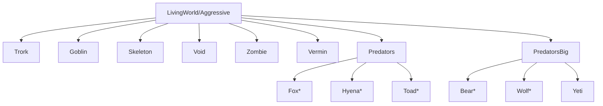

{/* [VERIFIED: 2026-02-13] */}

import { Aside, Tabs, TabItem, FileTree } from '@astrojs/starlight/components';

NPC groups define collections of NPCs that share common behaviors and attitudes. Groups are used for AI targeting, faction relationships, and behavior rules.

## Asset Location

Group definitions are stored in `Assets/Server/NPC/Groups/`:

<FileTree>
- Assets/Server/NPC/Groups/
  - Prey.json
  - Predators.json
  - PredatorsBig.json
  - Livestock.json
  - Critters.json
  - Birds.json
  - Aquatic.json
  - Vermin.json
  - Undead.json
  - Void.json
  - Player.json
  - Self.json
  - Creature/
    - Livestock/
    - Mammal/
    - Mythic/
    - Vermin/
  - Intelligent/
    - Aggressive/
      - Goblin/
      - Outlander/
      - Scarak.json
      - Trork/
    - Neutral/
  - LivingWorld/
    - Aggressive.json
    - Neutral.json
    - Passive.json
  - Undead/
</FileTree>

## Group Definition Schema

Groups can include or exclude individual roles and other groups. Under the hood, `NPCGroup` implements a `TagSet` with four fields:

| Field | Type | Description |
|-------|------|-------------|
| `IncludeRoles` | `string[]` | Individual NPC role IDs to include (supports wildcards) |
| `ExcludeRoles` | `string[]` | Individual NPC role IDs to exclude (supports wildcards) |
| `IncludeGroups` | `string[]` | Other NPC groups to include |
| `ExcludeGroups` | `string[]` | Other NPC groups to exclude |

### Including Roles

```json title="Prey.json"
{
  "IncludeRoles": [
    "Chicken",
    "Chicken_Chick",
    "Chicken_Desert",
    "Turkey",
    "Rabbit",
    "Bunny",
    "Mouse",
    "Penguin",
    "Flamingo"
  ]
}
```

### Including Other Groups

```json title="Livestock.json"
{
  "IncludeGroups": [
    "Bison",
    "Chicken",
    "Cow",
    "Pig",
    "Sheep",
    "Mouflon",
    "Turkey",
    "Chicken_Desert",
    "Goat",
    "Rabbit",
    "Camel",
    "Deer"
  ]
}
```

### Wildcard Patterns

Use `*` to match role name patterns:

```json title="Predators.json"
{
  "IncludeRoles": [
    "Fox*",
    "Hyena*",
    "Fen_Stalker",
    "Spark*",
    "Toad*"
  ]
}
```

This matches `Fox`, `Fox_Arctic`, `Fox_Desert`, etc.

### Combined Definition

```json title="Example combined group"
{
  "IncludeRoles": [
    "SpecificNPC_A",
    "SpecificNPC_B"
  ],
  "ExcludeRoles": [
    "SpecificNPC_C"
  ],
  "IncludeGroups": [
    "ExistingGroup_A",
    "ExistingGroup_B"
  ],
  "ExcludeGroups": [
    "ExistingGroup_C"
  ]
}
```

## Standard Groups

### Prey Groups

Animals that flee from predators:

| Group | Members |
|-------|---------|
| `Prey` | Chickens, Turkey, Rabbits, Mice, Penguins, Flamingos, young livestock |
| `PreyBig` | Larger prey animals |

### Predator Groups

Hostile hunting NPCs:

| Group | Members |
|-------|---------|
| `Predators` | Fox*, Hyena*, Fen_Stalker, Spark*, Toad* |
| `PredatorsBig` | Bear*, Wolf*, Yeti, Emberwulf, Leopard_Snow, Tiger_Sabertooth, Crocodile, Raptor_Cave, Rex_Cave |

### Livestock Groups

Domesticated animals:

```json title="Livestock.json"
{
  "IncludeGroups": [
    "Bison", "Chicken", "Cow", "Pig", "Sheep",
    "Mouflon", "Turkey", "Chicken_Desert", "Goat",
    "Rabbit", "Camel", "Deer"
  ]
}
```

### Environmental Groups

| Group | Description |
|-------|-------------|
| `Critters` | Small wildlife (squirrels, birds) |
| `Birds` | Flying bird NPCs |
| `Aquatic` | Water-dwelling creatures |
| `Vermin` | Pest creatures |

### Faction Groups

Located in `Intelligent/Aggressive/`:

| Group | Members |
|-------|---------|
| `Goblin` | Goblin faction members |
| `Trork` | Trork faction members |
| `Outlander` | Outlander faction members |
| `Scarak` | Scarak hive creatures |

### Undead Groups

| Group | Description |
|-------|-------------|
| `Undead` | All undead NPCs |
| `Skeleton` | Skeleton variants |
| `Zombie` | Zombie variants |

### Special Groups

| Group | Purpose |
|-------|---------|
| `Player` | Player entities |
| `Self` | Self-reference for targeting |
| `Void` | Void realm creatures |
| `Capture_Crate` | NPCs that can be captured |

## Living World Groups

High-level behavioral groupings:

```json title="LivingWorld/Aggressive.json"
{
  "IncludeGroups": [
    "Trork",
    "Goblin",
    "Skeleton",
    "Void",
    "Zombie",
    "Vermin",
    "Predators",
    "PredatorsBig"
  ]
}
```

| Group | Description | Behavior |
|-------|-------------|----------|
| `LivingWorld/Aggressive` | Hostile to players | Attack on sight |
| `LivingWorld/Neutral` | Defensive NPCs | Attack if provoked |
| `LivingWorld/Passive` | Non-hostile NPCs | Flee or ignore |

## Group Usage in Roles

Roles don't directly reference groups for "target" or "flee" lists. Instead, targeting works through two mechanisms: **attitude groups** and **entity filters**.

### Attitude System

Each role can set an `AttitudeGroup`, a `DefaultPlayerAttitude`, and a `DefaultNPCAttitude`. The attitude system resolves how an NPC feels about a target using a layered priority chain:

1. **Override attitudes** (highest priority) -- temporary per-entity overrides set by `ActionOverrideAttitude`, with a duration
2. **AttitudeGroup map** -- looks up the target's role in the NPC's assigned attitude group
3. **Default attitudes** (fallback) -- `DefaultPlayerAttitude` for players, `DefaultNPCAttitude` for other NPCs

```json title="Role attitude configuration"
{
  "DefaultPlayerAttitude": "HOSTILE",
  "DefaultNPCAttitude": "NEUTRAL",
  "AttitudeGroup": "Trork_Attitudes"
}
```

The `Attitude` enum has five values:

| Attitude | Description |
|----------|-------------|
| `IGNORE` | Ignoring the target |
| `HOSTILE` | Hostile towards the target |
| `NEUTRAL` | Neutral towards the target |
| `FRIENDLY` | Friendly towards the target |
| `REVERED` | Reveres the target |

<Aside>
`DefaultPlayerAttitude` defaults to `HOSTILE` and `DefaultNPCAttitude` defaults to `NEUTRAL` when not specified.
</Aside>

### Attitude Groups

Attitude groups are separate assets that map attitudes to NPC groups. They define which groups an NPC considers hostile, friendly, etc.

```json title="Trork_Attitudes.json"
{
  "Groups": {
    "HOSTILE": ["Player", "Goblin", "Livestock"],
    "FRIENDLY": ["Trork"],
    "IGNORE": ["Self"],
    "NEUTRAL": ["Undead"]
  }
}
```

When resolving a target's attitude, the system looks up the target's role index in the attitude map. If the target's role belongs to a group listed under `HOSTILE`, the NPC treats them as hostile.

### Entity Filters in Instructions

Behavior instructions can also use entity filters to target by group membership or attitude directly:

```json title="Filter by attitude"
{
  "Type": "Attitude",
  "Attitudes": ["HOSTILE"]
}
```

```json title="Filter by NPC group"
{
  "Type": "NPCGroup",
  "IncludeGroups": ["Player", "Livestock"],
  "ExcludeGroups": ["Self"]
}
```

These filters are used inside sensors and instructions to decide which entities an NPC should pay attention to.

## Group Hierarchy

Groups can be nested for organization. The `IncludeGroups` field pulls in all members of referenced groups, creating a hierarchy:



## Creating Custom Groups

### Simple Role Group

```json title="MyPlugin_CustomEnemies.json"
{
  "IncludeRoles": [
    "MyPlugin_Enemy_A",
    "MyPlugin_Enemy_B",
    "MyPlugin_Boss"
  ]
}
```

### Composite Group

```json title="MyPlugin_AllHostile.json"
{
  "IncludeRoles": [
    "MyPlugin_CustomEnemy"
  ],
  "IncludeGroups": [
    "Undead",
    "Trork"
  ]
}
```

### Pattern-Based Group

```json title="MyPlugin_AllVariants.json"
{
  "IncludeRoles": [
    "MyPlugin_Creature*"
  ]
}
```

This matches `MyPlugin_Creature`, `MyPlugin_Creature_Rare`, `MyPlugin_Creature_Boss`, etc.

## Best Practices

1. **Use wildcards sparingly** - Explicit lists are more maintainable
2. **Nest groups logically** - Create hierarchies for complex factions
3. **Consider symmetry** - If A is hostile to B, B should be hostile to A
4. **Use standard groups** - Reference existing groups like `Player` rather than duplicating
5. **Prefix custom groups** - Use plugin prefix to avoid conflicts

## Related

- [NPC Asset Overview](/asset-development/npcs/overview/) - NPC system overview
- [NPC Model Definitions](/asset-development/npcs/models/) - Model configuration
- [Entities Overview](/plugin-development/entities/overview/) - Entity API
