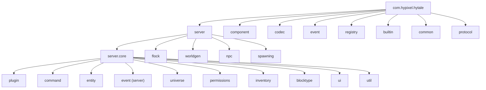

import { Aside, FileTree, Steps } from '@astrojs/starlight/components';

{/* [VERIFIED: 2026-02-17] */}

This page assumes you've completed the [Development Environment Setup](/getting-started/setup/). You should have Java 25 installed and a working plugin project before continuing.

There is no substitute for reading the actual server source. The decompiled code shows you exactly what happens when an event fires, how the ECS ticks, and what the command system really expects.

## Why Bother?

- **The API is a surface.** The source tells you *what happens* when you call it — execution order, edge cases, and engine assumptions.
- **Patterns become obvious.** The `builtin` package shows the idiomatic way to structure commands, register components, and handle events.
- **Debugging gets easier.** Stack traces pointing into server internals are only useful if you can read those internals.

## Getting the Decompiled Source

How you decompile depends on which build tool your project uses.

### Using the hytale-mod Plugin

Projects using the [`hytale-mod`](https://github.com/HytaleModding) Gradle plugin have a built-in decompile task:

```bash
./gradlew decompileServer
```

The output lands in `build/decompiled/` as a full directory tree of `.java` files.

<Aside type="caution">
The official [plugin template](https://github.com/HytaleModding/plugin-template) uses the ScaffoldIt plugin, which does **not** include a `decompileServer` task. If you're using the template, see the manual approach below.
</Aside>

### Manual Decompilation

If your project doesn't have the `decompileServer` task, you can decompile the server JAR directly using [Vineflower](https://github.com/Vineflower/vineflower):

<Steps>
1. Download the latest Vineflower JAR from the [releases page](https://github.com/Vineflower/vineflower/releases)

2. Locate the server JAR. The ScaffoldIt plugin caches it in Gradle's dependency cache. You can find the resolved path by checking `~/.gradle/caches/` or looking at Gradle's dependency report:
   ```bash
   ./gradlew dependencies --configuration compileClasspath
   ```

3. Run Vineflower:
   ```bash
   java -jar vineflower.jar -dgs=1 -hdc=0 -asc=1 -udv=0 HytaleServer.jar output/
   ```

4. The decompiled `.java` files will be in the `output/` directory.
</Steps>

<Aside type="note">
Decompiled code is not perfect. Variable names may be synthetic (`var1`, `var2`), control flow can look awkward, and comments from the original source are lost. The logic is accurate.
</Aside>

## Navigating the Source

The codebase is large but well-organized. Knowing the package layout saves hours.

### The Big Picture



### Where to Look First

#### Start here: `server.core.plugin`

Your home base. Contains `JavaPlugin`, `JavaPluginInit`, `PluginManager`, and `PluginState`. Read `JavaPlugin.java` first — seeing the full implementation reveals lifecycle hooks and utility methods the API surface doesn't make obvious.

<FileTree>
- com/hypixel/hytale/server/core/plugin/
  - JavaPlugin.java
  - JavaPluginInit.java
  - MissingPluginDependencyException.java
  - PluginBase.java
  - PluginClassLoader.java
  - PluginInit.java
  - PluginListPageManager.java
  - PluginManager.java
  - PluginState.java
  - PluginType.java
  - commands/
  - event/
  - pages/
  - pending/
  - registry/
</FileTree>

#### Next: `server.core.command`

Split into `commands/` (built-in commands) and `system/` (the framework). The `system` subpackage contains `CommandContext`, base command classes in `basecommands/`, and the `arguments/types/` subdirectory where `ArgTypes` lives. Reading `AbstractPlayerCommand` (in `system/basecommands/`) shows exactly what permission checking and argument parsing looks like before your `execute()` is called.

#### Then: `server.core.event`

All server-side events, organized by domain:

<FileTree>
- com/hypixel/hytale/server/core/event/events/
  - player/
  - entity/
  - ecs/
  - permissions/
  - BootEvent.java
  - PrepareUniverseEvent.java
  - ShutdownEvent.java
</FileTree>

Browse `player/` and `entity/` to see every event you can listen to. Each event class's fields tell you what data you get when it fires.

#### The ECS layer: `component`

The `component` package (`com.hypixel.hytale.component`) is the ECS framework — `Component`, `ComponentRegistry`, `Archetype`, `Store`, `Ref`, and related types. Understanding `Store` and `Ref` is essential for working with entities.

#### Real-world examples: `builtin`

The goldmine. Hytale's own gameplay modules — crafting, mounts, fluid simulation, block physics, NPCs, beds, and more. Each subpackage is a self-contained feature built on the same plugin APIs you have access to.

Worth reading early:
- `builtin.crafting` — item recipes and crafting stations
- `builtin.mounts` — entity interactions and player state
- `builtin.fluid` — block-level simulation logic
- `builtin.deployables` — placeable entity patterns

#### Everything else

| Package | What's inside |
|---|---|
| `codec` | Serialization framework (`Codec`, `KeyedCodec`) |
| `registry` | Global registries for block types, items, entities |
| `server.core.entity` | Entity management, damage, effects, movement |
| `server.core.inventory` | Inventory and item stack handling |
| `server.core.blocktype` | Block type definitions and behavior |
| `server.core.permissions` | Permission nodes and checking |
| `server.core.ui` | Server-driven UI elements |
| `protocol` | Client-server network protocol |
| `server.worldgen` | World generation pipelines |
| `server.npc` | NPC behavior and AI |
| `server.spawning` | Mob spawning rules |

## Opening in Your IDE

### IntelliJ IDEA

<Steps>
1. Open your project in IntelliJ
2. Navigate to the decompiled source directory in the Project panel
3. Right-click → **Mark Directory as → Sources Root**
4. IntelliJ will index the files, enabling search, go-to-definition, and find-usages
</Steps>

`Ctrl+Shift+F` (or `Cmd+Shift+F` on macOS) to search the entire decompiled codebase.

### VS Code

Open the decompiled folder as part of your workspace. The Java Extension Pack provides basic indexing, though IntelliJ's is significantly more thorough for a codebase this size.

## Tips for Reading Decompiled Code

**Start from what you know.** Pick a feature you want to build, find the closest `builtin` module, and trace how it works. Follow the imports.

**Search for patterns, not files.** Don't browse the `command` package top-down. Search the `builtin` package for `getCommandRegistry().register` and see how the engine's own code does it.

**Read the event fields.** Every event class is a contract. Its fields tell you what data is available and what you can modify.

## Next Steps

- [Your First Plugin](/getting-started/first-plugin/) — put what you've learned into practice
- [Plugin Lifecycle](/getting-started/plugin-lifecycle/) — understand when your code runs
- [ECS Overview](/plugin-development/core-concepts/ecs-overview/) — deep dive into the component system
