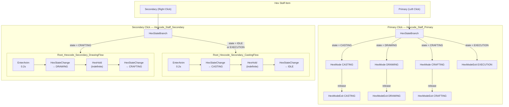
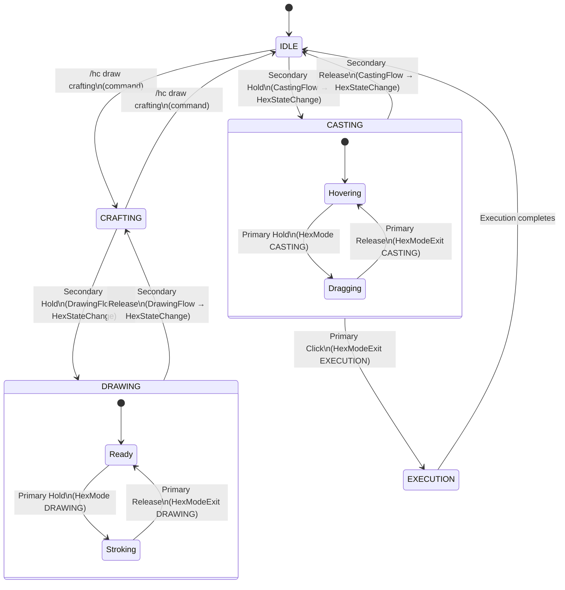
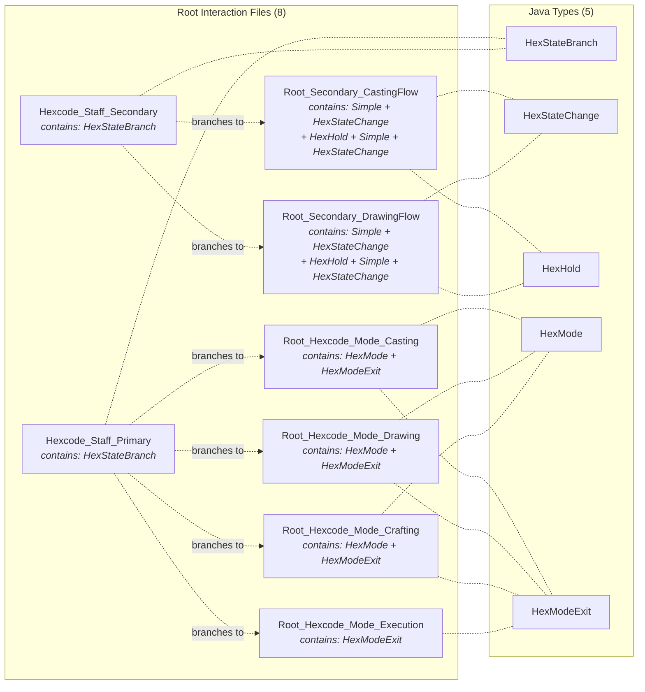

## Full Interaction Tree

How a mouse click flows through hexcode's interaction system from item input to state machine.
All interactions are inlined into 8 root files — no standalone interaction JSONs.

## State Transitions

How the hex staff drives the state machine through interactions.

## File Map

8 root interaction files and 5 Java types — everything is inlined.

