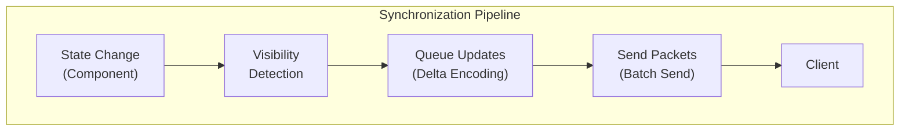

import { Aside, FileTree, Steps, Tabs, TabItem, Badge } from '@astrojs/starlight/components';

{/* [VERIFIED: 2026-03-21] */}

# Client Synchronization

The client synchronization system replicates server state to connected clients. It uses delta encoding to send only changed data and visibility culling to reduce bandwidth.

## Package Location

- Entity Tracker: `com.hypixel.hytale.server.core.modules.entity.tracker`
- Chunk Systems: `com.hypixel.hytale.server.core.universe.world.chunk.systems`
- Protocol: `com.hypixel.hytale.protocol.packets`

## Architecture Overview



## Entity Synchronization

### NetworkId Component

Each networked entity has a unique identifier:

```java
package com.hypixel.hytale.server.core.modules.entity.tracker;

public class NetworkId {
    private int id;  // Unique network identifier
}
```

### Visibility System

The system tracks which entities are visible to each player:

| Component | Description |
|-----------|-------------|
| `EntityViewer` | Tracks visible entities for a player |
| `Visible` | Tracks which players can see an entity |

### System Groups

Entity synchronization runs in ordered system groups:

| Group | Purpose |
|-------|---------|
| `FIND_VISIBLE_ENTITIES_GROUP` | Spatial queries for visibility |
| `QUEUE_UPDATE_GROUP` | Queue component changes |
| `SEND_PACKET_GROUP` | Send packets to clients |

### Synchronization Flow

1. **State Change**: Entity component is modified
2. **Mark Dirty**: `EffectControllerComponent` marks entity as "network outdated"
3. **Visibility Check**: Systems determine which players can see the entity
4. **Queue Update**: `QueueComponentUpdates` creates delta update objects
5. **Build Packet**: Updates collected into `EntityUpdates` packet
6. **Send**: Packet sent to player clients

### EntityUpdates Packet

The main packet for entity state synchronization:

```java
// Packet ID: 161 (compressed)
public class EntityUpdates {
    int[] removed;           // Entity IDs to remove
    EntityUpdate[] updates;  // State updates
}

public class EntityUpdate {
    int networkId;                    // Entity network ID
    ComponentUpdateType[] removed;    // Components to remove
    ComponentUpdate[] updates;        // Component updates
}
```

### Component Update Types

<Aside type="caution" title="Changed in Update 3">
`ComponentUpdate` was completely rewritten from a monolithic struct with all possible update fields into an abstract base class with polymorphic dispatch. Each update type is now a separate subclass (e.g., `TransformUpdate`, `NameplateUpdate`, `EquipmentUpdate`). The standalone `Equipment` and `Nameplate` classes were removed and replaced by their corresponding `ComponentUpdate` subclasses. A new `Prop` type (ID 25) was added. The [Update 3 changelog](/changelog/update-2-to-3/) has the complete breakdown.
</Aside>

26 component types can be synchronized:

| Type ID | Class | Description |
|---------|-------|-------------|
| 0 | `NameplateUpdate` | Display names |
| 1 | `UIComponentsUpdate` | Health bars, indicators |
| 2 | `CombatTextUpdate` | Damage numbers |
| 3 | `ModelUpdate` | Entity model |
| 4 | `PlayerSkinUpdate` | Player skin data |
| 5 | `ItemUpdate` | Held/displayed item |
| 6 | `BlockUpdate` | Block-form entity |
| 7 | `EquipmentUpdate` | Equipment loadout |
| 8 | `EntityStatsUpdate` | Stats and attributes |
| 9 | `TransformUpdate` | Position, rotation, scale |
| 10 | `MovementStatesUpdate` | Movement flags (23 bytes) |
| 11 | `EntityEffectsUpdate` | Active effects/buffs |
| 12 | `InteractionsUpdate` | Interaction options |
| 13 | `DynamicLightUpdate` | Light emission |
| 14 | `InteractableUpdate` | Can be interacted with |
| 15 | `IntangibleUpdate` | No collision (marker) |
| 16 | `InvulnerableUpdate` | Cannot be damaged (marker) |
| 17 | `RespondToHitUpdate` | Hit response behavior (marker) |
| 18 | `HitboxCollisionUpdate` | Collision settings |
| 19 | `RepulsionUpdate` | Entity repulsion |
| 20 | `PredictionUpdate` | Client prediction ID |
| 21 | `AudioUpdate` | Attached audio |
| 22 | `MountedUpdate` | Mount state |
| 23 | `NewSpawnUpdate` | Newly spawned flag (marker) |
| 24 | `ActiveAnimationsUpdate` | Playing animations |
| 25 | `PropUpdate` | Prop marker (marker) |

<Aside type="caution" title="Changed in Update 4">
`MovementStatesUpdate` grew from 22 to 23 bytes due to a new `boolean fallingFar` field added to `MovementStates` between `falling` and `climbing`. This also affects `ClientMovement` (153 → 155 bytes, two embedded `MovementStates`) and `MountMovement` (59 → 60 bytes).
</Aside>

### ComponentUpdate Hierarchy

`ComponentUpdate` is now an abstract base class. Each subclass carries only its own fields and is dispatched via a VarInt type ID:

```java
public abstract class ComponentUpdate {
    public abstract void serialize(ByteBuf buf);
    public abstract int computeSize();
    public void serializeWithTypeId(ByteBuf buf);
    public int computeSizeWithTypeId();

    public static ComponentUpdate deserialize(ByteBuf buf, int offset);
}
```

## Chunk Synchronization

<Aside type="note" title="New in Update 3">
Chunk-related packets (`SetChunk`, `ServerSetBlock`, `ServerSetBlocks`, `ServerSetFluid`, `ServerSetFluids`, `SetFluids`, `UnloadChunk`, `UpdateBlockDamage`, and others) now use `NetworkChannel.Chunks` instead of the default channel, enabling prioritized QUIC stream routing. All packet routing changes are listed in the [Update 3 changelog](/changelog/update-2-to-3/).
</Aside>

### SetChunk Packet

Sends complete chunk data to clients:

```java
// Packet ID: 131 (compressed, max 12MB)
public class SetChunk {
    int x, y, z;           // Chunk coordinates
    byte[] localLight;     // Local light data
    byte[] globalLight;    // Global light data
    byte[] data;           // Block data
}
```

### UnloadChunk Packet

Removes chunk from client:

```java
// Packet ID: 135 (8 bytes)
public class UnloadChunk {
    int chunkX;
    int chunkZ;
}
```

### Block Updates

Single block changes:

```java
// Packet ID: 140
public class ServerSetBlock {
    int x, y, z;      // Block coordinates
    int blockId;      // Block type ID
    byte filler;      // Filler data
    byte rotation;    // Block rotation
}
```

Batch block changes:

```java
// Packet ID: 141
public class ServerSetBlocks {
    BlockChange[] changes;  // Up to 1024 per packet
}
```

### Fluid Updates

```java
// Packet ID: 142
public class ServerSetFluid {
    int x, y, z;
    int fluidId;
    byte level;
}

// Packet ID: 143
public class ServerSetFluids {
    FluidChange[] changes;
}
```

## View Radius

The view radius controls how far clients can see:

```java
// Packet ID: 32
public class ViewRadius {
    int radius;  // Chunk distance
}
```

Entities and chunks outside the view radius are not synchronized.

## Optimization Techniques

### Delta Encoding

Only changed components are sent:

1. Full update on first visibility
2. Incremental updates thereafter
3. Remove updates when component is removed

### Visibility Culling

Entities outside view are not synchronized:

1. Spatial queries determine visible entities
2. Only visible entities queued for updates
3. Removed entities send removal packet

### Packet Batching

Updates are batched for efficiency:

1. Changes queued during tick
2. Batch built at end of tick
3. Single packet per player per frame

### Compression

Large packets use Zstd compression:

- `SetChunk` - Compressed (up to 12MB uncompressed)
- `EntityUpdates` - Compressed
- Reduces bandwidth significantly

## Synchronization Events

### Player Setup

When a player joins:

1. `SetClientId` - Assign client identifier
2. `ViewRadius` - Set chunk loading distance
3. `SetChunk` - Send nearby chunks
4. `EntityUpdates` - Send visible entities

### During Gameplay

Continuous synchronization:

1. Entity state changes detected
2. Chunk modifications tracked
3. Updates batched per tick
4. Packets sent to affected players

### Entity Spawn/Despawn

New entities:

1. Visibility system detects new entity
2. Full component update queued
3. `EntityUpdates` with `NewSpawn` flag sent

Removed entities:

1. Entity destroyed or leaves visibility
2. Network ID added to `removed` array
3. `EntityUpdates` with removal sent

## Plugin Considerations

### Sending Custom Updates

Use existing packet types through PacketHandler:

```java
// Send entity update
EntityUpdates packet = new EntityUpdates();
packet.updates = new EntityUpdate[] { update };
player.getPacketHandler().write(packet);

// Send block change
ServerSetBlock blockPacket = new ServerSetBlock();
blockPacket.x = x;
blockPacket.y = y;
blockPacket.z = z;
blockPacket.blockId = blockId;
player.getPacketHandler().write(blockPacket);
```

### Triggering Sync

Modify components to trigger automatic sync:

```java
// Component changes automatically queue network updates
TransformComponent transform = entity.getComponent(transformType);
transform.setPosition(newPosition);
// Entity tracker will detect change and sync
```

## Notable Wire Format Changes

<Aside type="caution" title="Changed in Update 4">
Several packet wire formats changed in Update 4:
- `ChatMessage`: max message length reduced from 4,096,000 to 255 characters
- `DisplayDebug`: `boolean fade` replaced by `byte flags` bitfield using `DebugFlags` enum (`Fade(0)`, `NoWireframe(1)`, `NoSolid(2)`)
- `MapImage`: direct `int[] data` pixel array replaced by palette-indexed compression (`int[] palette`, `byte bitsPerIndex`, `byte[] packedIndices`)
- `ServerInfo`: new nullable `HostAddress fallbackServer` field for specifying a fallback server
- `SyncInteractionChains`: max updates array length reduced from 4,096,000 to 128
</Aside>

## Best Practices

1. **Minimize state changes**: Frequent changes increase bandwidth
2. **Use appropriate update types**: Don't send full updates when delta suffices
3. **Respect view radius**: Don't sync entities outside player view
4. **Batch operations**: Group related changes when possible
5. **Consider compression**: Large data benefits from compression

## Related

- [Networking Overview](/plugin-development/networking/overview/) - Packet system architecture
- [Packet Types](/plugin-development/networking/packet-types/) - All packet IDs
- [Entity System](/plugin-development/entities/overview/) - Entity components
- [World System](/plugin-development/world/overview/) - Chunk management
