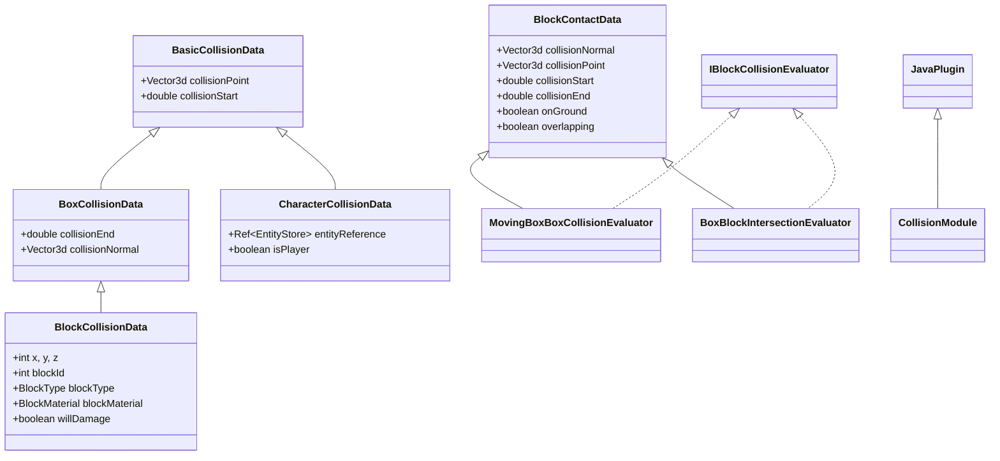
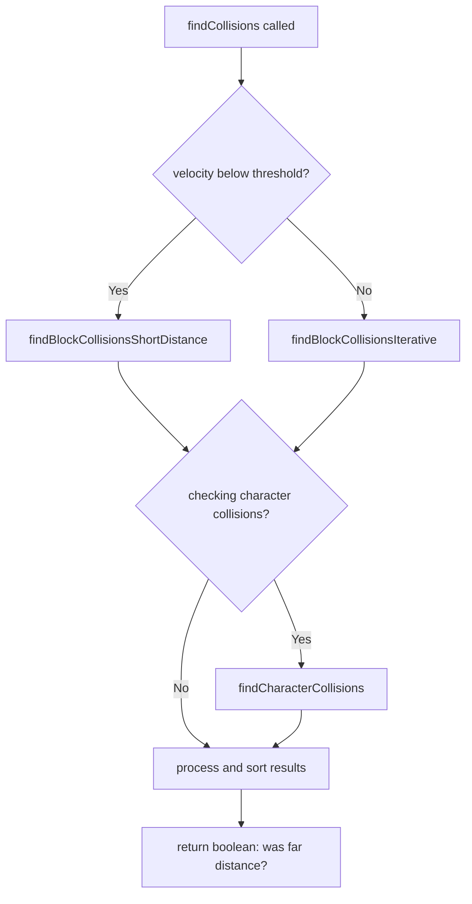
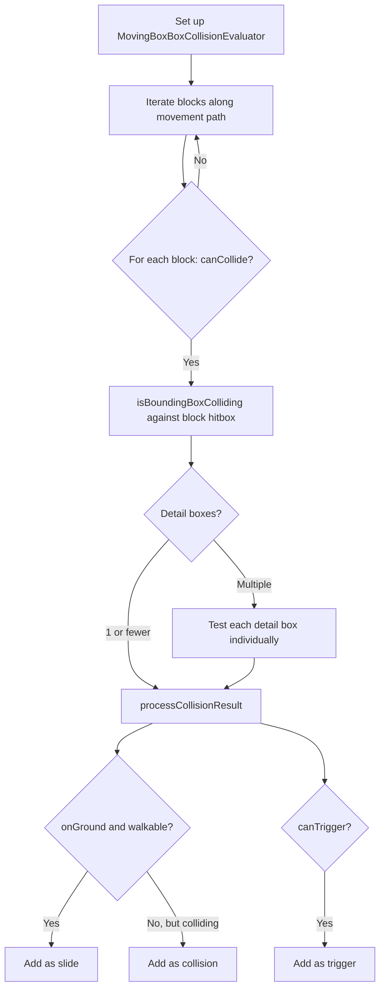
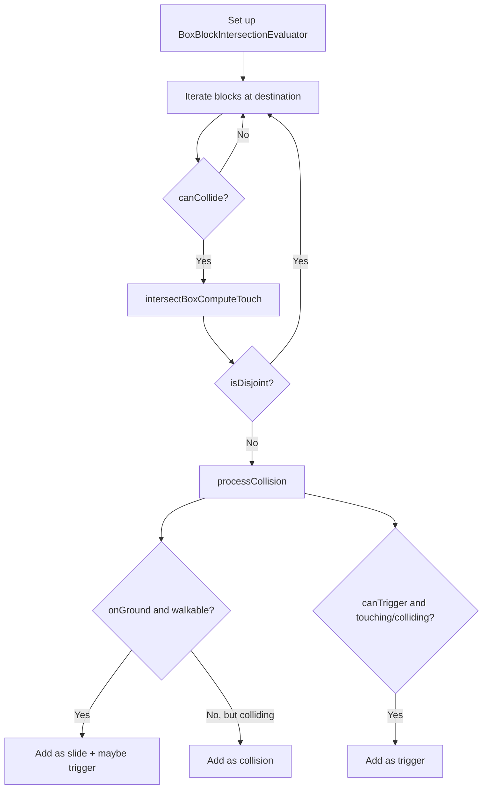
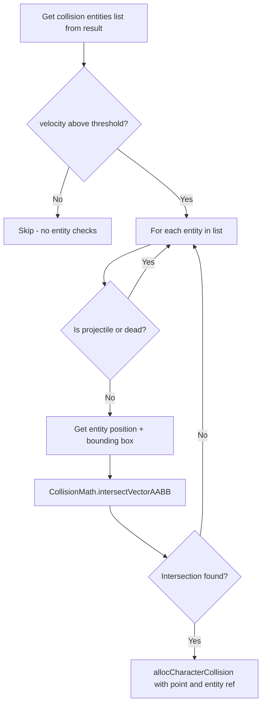

import { Aside, FileTree, Steps, Tabs, TabItem, Badge } from '@astrojs/starlight/components';

{/* [VERIFIED: 2026-02-13] */}

# Collision System

The Collision System detects and responds to collisions between entities and blocks. It uses swept collision detection for continuous movement and supports multiple collision types including solid, slide, trigger, and damage collisions.

## Package Location

`com.hypixel.hytale.server.core.modules.collision`

## Core Classes

| Class | Description |
|-------|-------------|
| `CollisionModule` | Main collision detection plugin, singleton |
| `CollisionResult` | Stores collision query results with pooled arrays |
| `CollisionConfig` | Per-block collision configuration and world lookup |
| `CollisionMaterial` | Material mask constants |
| `BasicCollisionData` | Base collision data with point and start parameter |
| `BoxCollisionData` | Extends BasicCollisionData, adds end parameter and normal |
| `BlockCollisionData` | Extends BoxCollisionData, adds block info |
| `CharacterCollisionData` | Extends BasicCollisionData, entity collision data |
| `BlockContactData` | Contact data base for evaluators (normal, point, ground state) |
| `MovingBoxBoxCollisionEvaluator` | Swept (continuous) box collision detection |
| `BoxBlockIntersectionEvaluator` | Static box-to-block intersection tests |
| `CollisionMath` | AABB intersection math utilities |
| `CollisionDataArray` | Pooled, sortable collision data list |
| `BlockCollisionProvider` | Block collision provider |
| `EntityCollisionProvider` | Entity collision provider |
| `IBlockCollisionConsumer` | Callback interface for collision events |
| `IBlockCollisionEvaluator` | Interface for collision evaluators |
| `CollisionFilter` | Functional interface for collision filtering |

## Class Hierarchy



## CollisionModule

The central collision detection system. It extends `JavaPlugin` and is accessed as a singleton.

```java
package com.hypixel.hytale.server.core.modules.collision;

public class CollisionModule extends JavaPlugin {
    public static final int VALIDATE_INVALID = -1;
    public static final int VALIDATE_OK = 0;
    public static final int VALIDATE_ON_GROUND = 1;
    public static final int VALIDATE_TOUCH_CEIL = 2;

    public static CollisionModule get();

    // returns true if far-distance (iterative) mode was used
    public static boolean findCollisions(
        Box collider,
        Vector3d pos,
        Vector3d v,
        CollisionResult result,
        ComponentAccessor<EntityStore> componentAccessor
    );

    // overload with stopOnCollisionFound flag
    public static boolean findCollisions(
        Box collider,
        Vector3d pos,
        Vector3d v,
        boolean stopOnCollisionFound,
        CollisionResult result,
        ComponentAccessor<EntityStore> componentAccessor
    );

    // block collision (iterative, far distance)
    public static void findBlockCollisionsIterative(
        World world,
        Box collider,
        Vector3d pos,
        Vector3d v,
        boolean stopOnCollisionFound,
        CollisionResult result
    );

    // block collision (direct, short distance)
    public static void findBlockCollisionsShortDistance(
        World world,
        Box collider,
        Vector3d pos,
        Vector3d v,
        CollisionResult result
    );

    // entity collision
    public static void findCharacterCollisions(
        Vector3d pos,
        Vector3d v,
        CollisionResult result,
        ComponentAccessor<EntityStore> componentAccessor
    );

    // position validation (instance method, returns int status code)
    public int validatePosition(
        World world,
        Box collider,
        Vector3d pos,
        CollisionResult result
    );

    // intersection detection (instance method)
    public void findIntersections(
        World world,
        Box collider,
        Vector3d pos,
        CollisionResult result,
        boolean triggerBlocks,
        boolean intersections
    );

    // check if velocity is below movement threshold
    public static boolean isBelowMovementThreshold(Vector3d v);
}
```

<Aside type="tip">
`findCollisions` returns a `boolean` indicating whether far-distance (iterative) mode was used -- not the collision results themselves. The results are stored in the `CollisionResult` you pass in. Also note that `validatePosition` and `findIntersections` are **instance methods**, not static.
</Aside>

<Aside type="caution">
`findCharacterCollisions` does **not** take a `Box collider` parameter -- it works with the collision entities list already set on the `CollisionResult`.
</Aside>

## CollisionResult

Stores all collision data from a query. Uses pooled `CollisionDataArray` instances for efficiency.

```java
package com.hypixel.hytale.server.core.modules.collision;

public class CollisionResult implements BoxBlockIterator.BoxIterationConsumer {
    // block collisions (solid blocks)
    private final CollisionDataArray<BlockCollisionData> blockCollisions;
    // block slides (walkable surfaces)
    private final CollisionDataArray<BlockCollisionData> blockSlides;
    // block triggers (sensor/damage blocks)
    private final CollisionDataArray<BlockCollisionData> blockTriggers;
    // entity collisions
    private final CollisionDataArray<CharacterCollisionData> characterCollisions;

    // evaluators
    private final MovingBoxBoxCollisionEvaluator movingBoxBoxCollision;
    private final BoxBlockIntersectionEvaluator boxBlockIntersection;

    // slide state (computed by process())
    public double slideStart;
    public double slideEnd;
    public boolean isSliding;

    public CollisionResult();
    public CollisionResult(boolean enableSlides, boolean enableCharacters);

    // reset all arrays for reuse
    public void reset();

    // sort results by collision start parameter
    public void process();

    // block collision queries
    public int getBlockCollisionCount();
    public BlockCollisionData getBlockCollision(int i);
    @Nullable public BlockCollisionData getFirstBlockCollision();
    @Nullable public BlockCollisionData forgetFirstBlockCollision();

    // character collision queries
    public int getCharacterCollisionCount();
    @Nullable public CharacterCollisionData getFirstCharacterCollision();
    @Nullable public CharacterCollisionData forgetFirstCharacterCollision();

    // trigger block queries
    public CollisionDataArray<BlockCollisionData> getTriggerBlocks();
    public void pruneTriggerBlocks(double distance);

    // allocators
    public BlockCollisionData newCollision();
    public BlockCollisionData newSlide();
    public BlockCollisionData newTrigger();
    public CharacterCollisionData allocCharacterCollision();

    // configuration
    public CollisionConfig getConfig();
    public BoxBlockIntersectionEvaluator getBoxBlockIntersection();
    public MovingBoxBoxCollisionEvaluator getMovingBoxBoxCollision();

    // collision entity management
    public List<Entity> getCollisionEntities();
    public void setCollisionEntities(List<Entity> collisionEntities);

    // slide control
    public void enableSlides();
    public void disableSlides();

    // character collision control
    public boolean isCheckingForCharacterCollisions();
    public void enableCharacterCollsions();  // note: typo in source
    public void disableCharacterCollisions();

    // trigger block control
    public void enableTriggerBlocks();
    public void disableTriggerBlocks();
    public boolean isCheckingTriggerBlocks();

    // damage block control
    public void enableDamageBlocks();
    public void disableDamageBlocks();
    public boolean isCheckingDamageBlocks();
    public boolean setDamageBlocking(boolean blocking);
    public boolean isDamageBlocking();

    // material-based collision control
    public void setCollisionByMaterial(int collidingMaterials);
    public void setCollisionByMaterial(int collidingMaterials, int walkableMaterials);
    public int getCollisionByMaterial();

    // walkable configuration
    public void setDefaultWalkableBehaviour();
    public void setWalkableByMaterial(int walkableMaterial);
    public void setNonWalkablePredicate(Predicate<CollisionConfig> classifier);

    // presets
    public void setDefaultCollisionBehaviour();
    public void setDefaultPlayerSettings();

    // overlap computation
    public boolean isComputeOverlaps();
    public void setComputeOverlaps(boolean computeOverlaps);
}
```

## Collision Data Types

### BasicCollisionData

The base class for all collision data. Stores the collision point and start parameter (0-1 range along movement vector).

```java
public class BasicCollisionData {
    public final Vector3d collisionPoint;
    public double collisionStart;

    public void setStart(Vector3d point, double start);
}
```

### BoxCollisionData

Extends `BasicCollisionData` with an end parameter and collision normal. Used as the base for block collisions.

```java
public class BoxCollisionData extends BasicCollisionData {
    public double collisionEnd;
    public final Vector3d collisionNormal;

    public void setEnd(double collisionEnd, Vector3d collisionNormal);
}
```

### BlockCollisionData

Full block collision information:

```java
public class BlockCollisionData extends BoxCollisionData {
    public int x;                      // block world X
    public int y;                      // block world Y
    public int z;                      // block world Z
    public int blockId;                // block type ID
    public int rotation;               // block rotation index
    @Nullable public BlockType blockType;
    @Nullable public BlockMaterial blockMaterial;
    public int detailBoxIndex;         // which detail hitbox was hit
    public boolean willDamage;         // block causes damage
    public int fluidId;                // fluid at this position
    @Nullable public Fluid fluid;
    public boolean touching;
    public boolean overlapping;

    public void setBlockData(CollisionConfig collisionConfig);
    public void setDetailBoxIndex(int detailBoxIndex);
    public void setTouchingOverlapping(boolean touching, boolean overlapping);
    public void clear();
}
```

### CharacterCollisionData

Entity collision data. Note: this extends `BasicCollisionData` directly, **not** `BoxCollisionData` -- so it has no `collisionEnd` or `collisionNormal`.

```java
public class CharacterCollisionData extends BasicCollisionData {
    public Ref<EntityStore> entityReference;
    public boolean isPlayer;

    public void assign(
        Vector3d collisionPoint,
        double collisionVectorScale,
        Ref<EntityStore> entityReference,
        boolean isPlayer
    );
}
```

## Collision Evaluators

### BlockContactData

Base class for both evaluators. Holds contact state like ground detection and collision geometry:

```java
public class BlockContactData {
    protected final Vector3d collisionNormal;
    protected final Vector3d collisionPoint;
    protected double collisionStart;
    protected double collisionEnd;
    protected boolean onGround;
    protected boolean overlapping;
    protected int damage;
    protected boolean isSubmergeFluid;

    public Vector3d getCollisionNormal();
    public Vector3d getCollisionPoint();
    public double getCollisionStart();
    public double getCollisionEnd();
    public boolean isOnGround();
    public boolean isOverlapping();
    public int getDamage();
    public boolean isSubmergeFluid();
}
```

### IBlockCollisionEvaluator

Interface that both evaluators implement:

```java
public interface IBlockCollisionEvaluator {
    double getCollisionStart();
    void setCollisionData(BlockCollisionData data, CollisionConfig collisionConfig, int hitboxIndex);
}
```

### MovingBoxBoxCollisionEvaluator

Swept (continuous) collision detection between a moving box and stationary blocks. Extends `BlockContactData` and implements `IBlockCollisionEvaluator`.

```java
public class MovingBoxBoxCollisionEvaluator extends BlockContactData
        implements IBlockCollisionEvaluator {

    public MovingBoxBoxCollisionEvaluator setCollider(Box collider);

    // set movement origin and direction
    public MovingBoxBoxCollisionEvaluator setMove(Vector3d pos, Vector3d v);

    // test collision against a block bounding box at world position
    public boolean isBoundingBoxColliding(Box blockBoundingBox, double x, double y, double z);

    public boolean isTouching();
    public void setCollisionEnd(double collisionEnd);
    public void setCheckForOnGround(boolean checkForOnGround);
    public boolean isCheckForOnGround();
    public boolean isComputeOverlaps();
    public void setComputeOverlaps(boolean computeOverlaps);
}
```

### BoxBlockIntersectionEvaluator

Static box-to-block intersection tests (used for short-distance and position validation). Extends `BlockContactData` and implements `IBlockCollisionEvaluator`.

```java
public class BoxBlockIntersectionEvaluator extends BlockContactData
        implements IBlockCollisionEvaluator {

    // set the box and position
    public BoxBlockIntersectionEvaluator setBox(Box box);
    public BoxBlockIntersectionEvaluator setBox(Box box, Vector3d pos);
    public BoxBlockIntersectionEvaluator setPosition(Vector3d pos);
    public BoxBlockIntersectionEvaluator offsetPosition(Vector3d offset);
    public BoxBlockIntersectionEvaluator expandBox(double radius);
    public BoxBlockIntersectionEvaluator setStartEnd(double start, double end);

    // returns int code (use CollisionMath to interpret)
    public int intersectBox(Box otherBox, double x, double y, double z);
    public int intersectBoxComputeTouch(Box otherBox, double x, double y, double z);
    public int intersectBoxComputeOnGround(Box otherBox, double x, double y, double z);

    // convenience
    public boolean isBoxIntersecting(Box otherBox, double x, double y, double z);
    public boolean isTouching();
    public boolean touchesCeil();
}
```

<Aside type="tip">
The `intersectBox*` methods return an `int` code, not a boolean. Use `CollisionMath.isDisjoint(code)`, `CollisionMath.isOverlapping(code)`, and `CollisionMath.isTouching(code)` to interpret the result.
</Aside>

## CollisionMath

AABB intersection utilities. All methods are static. This class cannot be instantiated.

```java
public class CollisionMath {
    // intersection code constants
    public static final int DISJOINT = 0;
    public static final int TOUCH_X = 1;
    public static final int TOUCH_Y = 2;
    public static final int TOUCH_Z = 4;
    public static final int TOUCH_ANY = 7;
    public static final int OVERLAP_X = 8;
    public static final int OVERLAP_Y = 16;
    public static final int OVERLAP_Z = 32;
    public static final int OVERLAP_ALL = 56;

    // interpret intersection codes
    public static boolean isDisjoint(int code);
    public static boolean isOverlapping(int code);
    public static boolean isTouching(int code);

    // AABB-AABB intersection (returns int code)
    public static int intersectAABBs(
        Vector3d p, Box bbP, Vector3d q, Box bbQ
    );
    public static int intersectAABBs(
        double px, double py, double pz, Box bbP,
        double qx, double qy, double qz, Box bbQ
    );

    // vector-AABB intersection
    public static boolean intersectVectorAABB(
        Vector3d pos, Vector3d vec,
        double x, double y, double z,
        Box box, Vector2d minMax
    );

    // ray-AABB intersection
    public static boolean intersectRayAABB(
        Vector3d pos, Vector3d ray,
        double x, double y, double z,
        Box box, Vector2d minMax
    );
    public static double intersectRayAABB(
        Vector3d pos, Vector3d ray,
        double x, double y, double z,
        Box box
    );

    // swept AABB intersection (minkowski sum approach)
    public static boolean intersectSweptAABBs(
        Vector3d posP, Vector3d vP, Box p,
        Vector3d posQ, Box q,
        Vector2d minMax, Box temp
    );
}
```

<Aside type="note">
`intersectAABBs` returns an `int` intersection code, not a boolean. The code is a bitmask of touch/overlap flags per axis. `intersectVectorAABB` returns true only if the intersection happens within the vector length (t <= 1.0).
</Aside>

## Material Masks

Block materials affect collision behavior. Defined in `CollisionMaterial` (and mirrored in `CollisionConfig`):

| Constant | Value | Description |
|----------|-------|-------------|
| `MATERIAL_EMPTY` | 1 | No collision (air) |
| `MATERIAL_FLUID` | 2 | Fluid block (water, lava) |
| `MATERIAL_SOLID` | 4 | Solid collision |
| `MATERIAL_SUBMERGED` | 8 | Fully in fluid |
| `MATERIAL_SET_ANY` | 15 | All non-damage materials |
| `MATERIAL_DAMAGE` | 16 | Damage on contact |
| `MATERIAL_SET_NONE` | 0 | No materials |

## IBlockCollisionConsumer

Callback interface for collision events:

```java
public interface IBlockCollisionConsumer {
    enum Result {
        CONTINUE,
        STOP,
        STOP_NOW
    }

    Result onCollision(int x, int y, int z,
        Vector3d pos, BlockContactData contactData,
        BlockData blockData, Box hitbox);

    Result probeCollisionDamage(int x, int y, int z,
        Vector3d pos, BlockContactData contactData,
        BlockData blockData);

    void onCollisionDamage(int x, int y, int z,
        Vector3d pos, BlockContactData contactData,
        BlockData blockData);

    Result onCollisionSliceFinished();

    void onCollisionFinished();
}
```

## CollisionFilter

A functional interface used for position validation filtering:

```java
@FunctionalInterface
public interface CollisionFilter<D, T> {
    boolean test(T t, int code, D data, CollisionConfig config);
}
```

## Collision Detection Flow

### How findCollisions Works



### Block Collision (Iterative / Far Distance)



### Block Collision (Short Distance)



### Entity Collision



## Collision Types

### Solid Collision

Standard blocking collision:
- Stops movement at collision point
- Returns collision normal for response
- Used for walls, floors, ceilings

### Slide Collision

Walkable surface collision:
- Detected when `onGround` is true and block material is walkable
- Allows movement along surface
- Used for slopes and stairs
- Entity can slide along the surface

### Trigger Collision

Non-blocking sensor collision:
- Does not stop movement
- Fires interaction events (`CollisionEnter`, `Collision`, `CollisionLeave`)
- Used for pressure plates, zones, fluids

### Damage Collision

Harmful surface collision:
- Blocks with `damageToEntities > 0` or fluids with damage
- Added as trigger blocks, damage amount tracked
- Used for spikes, lava, etc.

## Usage Examples

### Basic Collision Check

```java
import com.hypixel.hytale.server.core.modules.collision.CollisionModule;
import com.hypixel.hytale.server.core.modules.collision.CollisionResult;
import com.hypixel.hytale.math.shape.Box;
import com.hypixel.hytale.math.vector.Vector3d;

public boolean wouldCollide(Box entityBox, Vector3d position, Vector3d movement,
                            ComponentAccessor<EntityStore> accessor) {
    CollisionResult result = new CollisionResult();

    CollisionModule.findCollisions(
        entityBox,
        position,
        movement,
        result,
        accessor
    );

    return result.getBlockCollisionCount() > 0;
}
```

### Collision Response

```java
public Vector3d clampMovement(Box entityBox, Vector3d position,
                              Vector3d movement, ComponentAccessor<EntityStore> accessor) {
    CollisionResult result = new CollisionResult();

    CollisionModule.findCollisions(entityBox, position, movement, result, accessor);

    if (result.getBlockCollisionCount() > 0) {
        BlockCollisionData first = result.getFirstBlockCollision();

        double clampedT = first.collisionStart;
        return movement.multiply(clampedT);
    }

    return movement;
}
```

### Position Validation

```java
public boolean isPositionValid(World world, Box entityBox, Vector3d position) {
    CollisionResult result = new CollisionResult();

    int code = CollisionModule.get().validatePosition(world, entityBox, position, result);

    if (code == CollisionModule.VALIDATE_INVALID) {
        return false;
    }

    boolean onGround = (code & CollisionModule.VALIDATE_ON_GROUND) != 0;
    boolean touchCeil = (code & CollisionModule.VALIDATE_TOUCH_CEIL) != 0;
    return true;
}
```

## Best Practices

1. **Reuse CollisionResult**: Call `reset()` instead of creating new instances -- the pooled arrays avoid allocation overhead
2. **Choose appropriate method**: Short-distance is used automatically when velocity is below threshold
3. **Check material masks**: Use `setCollisionByMaterial()` and `setWalkableByMaterial()` to control what blocks collide
4. **Handle slides separately**: Slides allow movement along walkable surfaces, collisions block
5. **Process triggers**: Trigger blocks fire interaction events (`CollisionEnter`, `Collision`, `CollisionLeave`)
6. **Understand return types**: `findCollisions` returns `boolean` (far distance flag), `validatePosition` returns `int` (status code)
7. **Instance vs static**: `findCollisions`, `findBlockCollisions*`, and `findCharacterCollisions` are static; `validatePosition` and `findIntersections` are instance methods

## Related

- [Physics Overview](/plugin-development/entities/overview/) - Physics system architecture
- [Hitbox System](/plugin-development/physics/hitboxes/) - Entity hitboxes
- [Block System](/plugin-development/blocks/overview/) - Block types and materials
