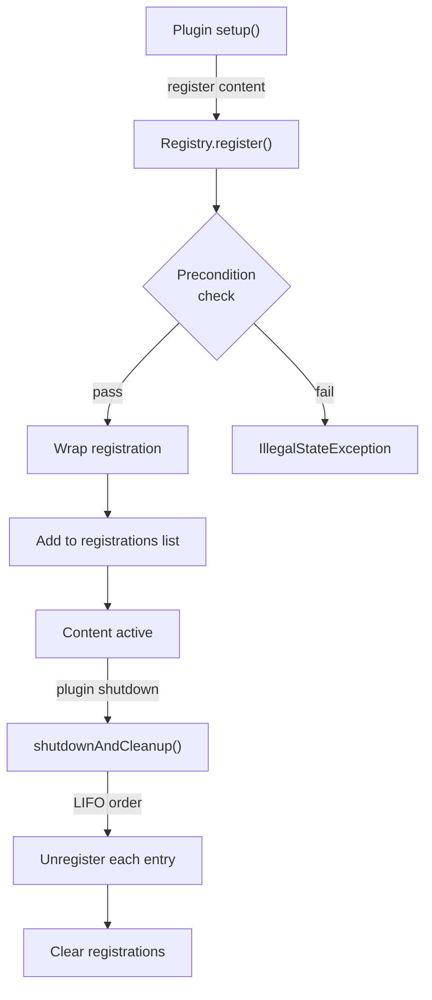

import { Aside, FileTree, Steps, Tabs, TabItem, Badge } from '@astrojs/starlight/components';

{/* [VERIFIED: 2026-02-19] */}

# Creating Registries

All custom content in Hytale is registered through the registry system during your plugin's `setup()` phase. This page covers how registration works, what happens during the lifecycle, and how cleanup is handled automatically.

## Package Location

- Registry base: `com.hypixel.hytale.registry.Registry`
- Registration: `com.hypixel.hytale.registry.Registration`
- Plugin base: `com.hypixel.hytale.server.core.plugin.PluginBase`
- Codec map registry: `com.hypixel.hytale.server.core.plugin.registry.CodecMapRegistry`

## Registration Lifecycle

All registrations follow the same lifecycle pattern: register during `setup()`, use during runtime, and automatic cleanup on shutdown.



### Preconditions

Every plugin registry is constructed with a precondition that checks whether the plugin is in a valid state. Attempting to register content when the plugin is in `NONE` or `DISABLED` state throws an `IllegalStateException`:

```java
import com.hypixel.hytale.server.core.plugin.PluginBase;

public class MyPlugin extends PluginBase {
    @Override
    protected void setup() {
        // safe -- plugin is in SETUP state
        getCommandRegistry().registerCommand(new MyCommand());
    }
}
```

If a registry is not enabled (e.g., after shutdown), the `register()` method calls `unregister()` on the registration immediately and throws.

### Wrapped Registrations

When you call `register()`, the registry wraps your registration with two callbacks:

1. **isEnabled** -- returns `true` as long as the registry is enabled or the registration itself is still registered
2. **unregister** -- removes the registration from the registry's internal list and calls the original `unregister()` callback

This wrapping means you can call `unregister()` on a returned `Registration` at any time to manually remove it before shutdown:

```java
import com.hypixel.hytale.registry.Registration;

@Override
protected void setup() {
    Registration reg = getEventRegistry().register(SomeEvent.class, this::onEvent);

    // later, if needed
    reg.unregister();
}
```

## Registering Content

### Commands

```java
import com.hypixel.hytale.server.core.command.AbstractCommand;

@Override
protected void setup() {
    getCommandRegistry().registerCommand(new MyCommand());
}
```

### Events

```java
import com.hypixel.hytale.event.EventPriority;
import com.hypixel.hytale.server.core.event.PlayerConnectEvent;

@Override
protected void setup() {
    getEventRegistry().register(PlayerConnectEvent.class, this::onConnect);
    getEventRegistry().register(EventPriority.LATE, PlayerConnectEvent.class, this::onConnectLate);
}
```

### ECS Components and Systems

```java
import com.hypixel.hytale.component.ComponentType;
import com.hypixel.hytale.server.core.universe.world.storage.EntityStore;

@Override
protected void setup() {
    ComponentType<EntityStore, MyComponent> type =
        getEntityStoreRegistry().registerComponent(MyComponent.class, MyComponent::new);

    ComponentType<EntityStore, SavedComponent> savedType =
        getEntityStoreRegistry().registerComponent(
            SavedComponent.class, "my_saved", SavedComponent.CODEC);

    getEntityStoreRegistry().registerSystem(new MySystem());
}
```

Store references to `ComponentType` and `ResourceType` -- you need them later to access component data on entities.

### Codec Map Entries

For content that plugs into existing serialization maps (e.g., adding a new entity effect type, interaction type, or tag pattern):

```java
import com.hypixel.hytale.server.core.plugin.registry.CodecMapRegistry;

@Override
protected void setup() {
    getCodecRegistry(SomeAsset.CODEC_MAP)
        .register("my_custom_type", MyCustomType.class, MyCustomType.CODEC);
}
```

`CodecMapRegistry` acquires the global asset write lock when unregistering entries, so cleanup is thread-safe even if assets are being loaded concurrently.

### Tasks

```java
import java.util.concurrent.CompletableFuture;

@Override
protected void setup() {
    CompletableFuture<Void> task = CompletableFuture.runAsync(() -> {
        // background work
    });
    getTaskRegistry().registerTask(task);
}
```

### Custom Asset Stores

To create a new asset type that gets loaded from JSON files in asset packs, build a `HytaleAssetStore` and register it with `getAssetRegistry()`.

#### Asset Class

Your asset class must extend `JsonAssetWithMap`:

```java
import com.hypixel.hytale.assetstore.map.JsonAssetWithMap;
import com.hypixel.hytale.assetstore.DefaultAssetMap;
import com.hypixel.hytale.assetstore.codec.AssetBuilderCodec;
import com.hypixel.hytale.codec.Codec;
import com.hypixel.hytale.codec.KeyedCodec;

public class SpawnTableAsset extends JsonAssetWithMap<String, DefaultAssetMap<String, SpawnTableAsset>> {
    public String[] entries;
    public float weight;

    public static final AssetBuilderCodec<String, SpawnTableAsset> CODEC =
        AssetBuilderCodec.builder(SpawnTableAsset.class, SpawnTableAsset::new)
            .append(
                new KeyedCodec<>("Entries", Codec.STRING_ARRAY),
                (obj, entries) -> obj.entries = entries,
                obj -> obj.entries
            )
            .add()

            .append(
                new KeyedCodec<>("Weight", Codec.FLOAT),
                (obj, weight) -> obj.weight = weight,
                obj -> obj.weight
            )
            .add()

            .build();
}
```

#### Registering the Asset Store

Use `HytaleAssetStore.builder()` to configure the store, then register it during `setup()`:

```java
import com.hypixel.hytale.assetstore.DefaultAssetMap;
import com.hypixel.hytale.server.core.asset.HytaleAssetStore;

@Override
protected void setup() {
    getAssetRegistry().register(
        HytaleAssetStore.builder(SpawnTableAsset.class, new DefaultAssetMap<>())
            .setPath("MyMod/SpawnTables")
            .setCodec(SpawnTableAsset.CODEC)
            .setKeyFunction(SpawnTableAsset::getId)
            .loadsAfter(Item.class, BlockType.class)
            .build()
    );
}
```

Assets are loaded from `Server/MyMod/SpawnTables/` in each asset pack. The store is automatically unregistered when the plugin shuts down.

#### Builder Methods

| Method | Description |
|--------|-------------|
| `setPath(String)` | Directory path under `Server/` where JSON files are loaded from |
| `setCodec(AssetCodec)` | Codec used to deserialize asset JSON files |
| `setKeyFunction(Function)` | Extracts the key (usually string ID) from a decoded asset |
| `setExtension(String)` | File extension to match (default: `".json"`) |
| `loadsAfter(Class...)` | Declare asset types that must load before this store |
| `loadsBefore(Class...)` | Declare asset types that must load after this store |
| `preLoadAssets(List)` | Pre-add default assets before directory loading |
| `setReplaceOnRemove(Function)` | Provide a replacement asset when one is deleted |
| `unmodifiable()` | Make the asset map read-only after loading |
| `setPacketGenerator(AssetPacketGenerator)` | Generate network packets for client sync |

## Automatic Cleanup

<Aside type="note">
`Registry` has a `shutdownAndCleanup(boolean)` method (added in Update 3) that disables the registry, iterates registrations in reverse (LIFO) order calling cleanup on each, then clears the list.
</Aside>

When your plugin shuts down, all registries share a common `shutdownTasks` list in `PluginBase`. The cleanup iterates this list in reverse order, ensuring that content registered last is unregistered first. This respects dependency ordering -- if system B depends on component A, and A was registered before B, then B is unregistered first.

You do not need to manually unregister:
- Event listeners
- Commands
- ECS components, resources, and systems
- Tasks (automatically cancelled)
- Codec registrations
- Asset stores

### ComponentRegistry Cleanup

For ECS content specifically, `ComponentRegistry` has additional cleanup behavior. When a component is unregistered, any system whose query requires that component is also automatically unregistered. This prevents systems from running against missing data.

## Serializable Registrations and Codecs

When registering ECS components or resources that need persistence (saving/loading with worlds), provide a string ID and a `BuilderCodec`:

```java
import com.hypixel.hytale.codec.builder.BuilderCodec;
import com.hypixel.hytale.component.ComponentType;
import com.hypixel.hytale.server.core.universe.world.storage.EntityStore;

@Override
protected void setup() {
    ComponentType<EntityStore, MyData> dataType =
        getEntityStoreRegistry().registerComponent(
            MyData.class, "My_data", MyData.CODEC);
}
```

The string ID is used as the serialization key in stored documents. It must be unique within the component registry. The codec defines how the component is serialized to and deserialized from BSON.

<Aside type="caution">
`KeyedCodec` field names must start with an uppercase letter. This is a Hytale codec convention enforced during validation.
</Aside>

For a detailed guide on building codecs, see the [Serialization](/plugin-development/serialization/overview/) section.

## Best Practices

1. **Register in `setup()`** -- perform all registrations in the `setup()` method, never in `start()` or event handlers
2. **Store type references** -- keep references to `ComponentType` and `ResourceType` for runtime access
3. **Let cleanup happen automatically** -- do not manually unregister unless you have a specific runtime reason
4. **Use appropriate event priorities** -- choose priorities based on whether you need to modify or observe events
5. **Provide codecs for persistent data** -- any component or resource that should survive server restarts needs a codec and string ID

## Related

- [Registry System Overview](/plugin-development/registries/overview/) - Architecture and load order
- [Existing Registries](/plugin-development/registries/existing-registries/) - Complete catalog of all registries
- [Serialization](/plugin-development/serialization/overview/) - Building codecs for serializable content
- [Plugin Lifecycle](/getting-started/plugin-lifecycle/) - Setup and shutdown phases
- [ECS Overview](/plugin-development/core-concepts/ecs-overview/) - Component and system registration
