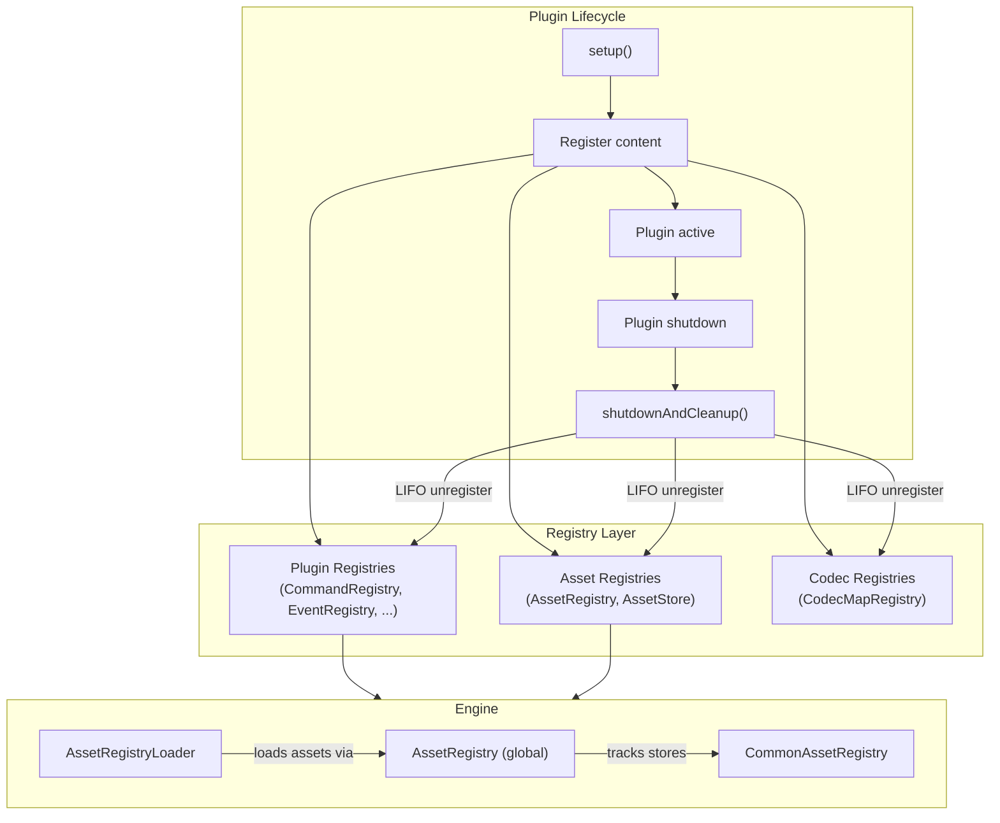

import { Aside, FileTree, Steps, Tabs, TabItem, Badge } from '@astrojs/starlight/components';

{/* [VERIFIED: 2026-02-19] */}

# Registry System Overview

The registry system is the backbone of Hytale's content management. Every piece of game content -- blocks, items, entities, sounds, particles, and more -- is tracked and organized through registries. Plugins use registries to add, modify, and extend game content in a structured way that supports automatic cleanup and mod interoperability.

## Package Location

- Registry base: `com.hypixel.hytale.registry.Registry`
- Registration: `com.hypixel.hytale.registry.Registration`
- Asset registry: `com.hypixel.hytale.assetstore.AssetRegistry`
- Asset registry loader: `com.hypixel.hytale.server.core.asset.AssetRegistryLoader`
- Common asset registry: `com.hypixel.hytale.server.core.asset.common.CommonAssetRegistry`
- Plugin base: `com.hypixel.hytale.server.core.plugin.PluginBase`

## What Are Registries?

Registries are typed containers that track registered content and manage its lifecycle. They enforce preconditions (ensuring content is only registered when valid), wrap registrations with automatic unregister callbacks, and support enable/disable states.

There are two broad categories:

| Category | Description | Examples |
|----------|-------------|---------|
| **Plugin registries** | Accessed via `PluginBase` getter methods, scoped to a plugin's lifecycle | `CommandRegistry`, `EventRegistry`, `EntityStoreRegistry` |
| **Internal registries** | Used by the engine for asset management and internal bookkeeping | `AssetRegistry`, `ComponentRegistry`, `CommonAssetRegistry` |

Plugin registries share a common `shutdownTasks` list in `PluginBase`. When the plugin shuts down, all registrations across all registries are cleaned up together in LIFO order.

## Registry Architecture



## Asset Loading

Hytale loads assets through `AssetRegistryLoader`, which manages the full lifecycle of asset stores registered in `AssetRegistry`.

### Load Order

Asset stores declare load dependencies using `loadsAfter` and `loadsBefore` directives. The `AssetStoreIterator` resolves these into a topological order, throwing a `CircularDependencyException` if cycles are detected.

```java
AssetRegistry.register(
    HytaleAssetStore.builder(BlockType.class, blockTypeAssetMap)
        .setPath("Item/Block/Blocks")
        .setCodec(BlockType.CODEC)
        .setKeyFunction(BlockType::getId)
        .loadsAfter(
            BlockBoundingBoxes.class,
            BlockSoundSet.class,
            SoundEvent.class,
            BlockParticleSet.class,
            BlockBreakingDecal.class
        )
        .build()
);
```

In this example, `BlockType` assets load only after `BlockBoundingBoxes`, `BlockSoundSet`, `SoundEvent`, `BlockParticleSet`, and `BlockBreakingDecal` have all finished loading. This guarantees that any references to those asset types are valid by the time block types are deserialized.

### Loading Phases

<Steps>
1. **Pre-load**: Internal ("pre-added") assets are loaded first. These are hardcoded defaults like `BlockType.EMPTY`, `BlockType.UNKNOWN`, and `SoundEvent.EMPTY_SOUND_EVENT`.

2. **Directory load**: Assets are loaded from the asset pack's `Server/` directory. Each asset store reads from its configured path (e.g., `Server/Item/Block/Blocks/`).

3. **Validation**: Codec defaults are validated for the base `Hytale:Hytale` pack. Stores with file monitors begin watching for hot-reload changes on mutable packs.

4. **Client sync**: `sendAssets()` serializes loaded assets into network packets and sends them to connecting clients.
</Steps>

### Asset Editor Access

The `AssetTypeRegistry` manages asset types available in the in-game asset editor. Each registered `AssetTypeHandler` defines an asset type with a file extension, directory path, and editing capabilities. The editor sends a setup packet listing all registered types when a client connects to the editor.

## Override Behavior

When multiple packs provide an asset with the same name, `CommonAssetRegistry` uses **last-write-wins** semantics. Each pack's assets are appended to a list keyed by name. The last entry in the list is the "active" asset.

```java
CommonAssetRegistry.AddCommonAssetResult result =
    CommonAssetRegistry.addCommonAsset("MyMod:MyPack", asset);

// result.getActiveAsset() - the currently effective asset
// result.getPreviousNameAsset() - what was active before this override
```

When a pack is removed, the previous pack's asset becomes active again. This stack-based approach means removal is clean, but load order determines which mod "wins" when multiple mods modify the same asset.

## Mod Compatibility

The default last-write-wins behavior creates conflicts when multiple mods modify the same base asset. Two community solutions address this:

### Zima

Zima is an intent-based merging system by zenkuro. Rather than directly overwriting asset files, mods declare integration specs describing what they want to change. Zima reads these specs, resolves conflicts deterministically, and outputs generated override assets as a runtime pack. This allows multiple mods to modify the same base asset without either mod needing to know about the other.

### HyTalor

HyTalor is a lightweight asset patching framework. Mods provide smaller patches that are merged at runtime rather than full file replacements. It supports hot-reload for rapid iteration and serves as a framework for other mods to build patching logic on top of.

Both tools solve the fundamental problem of two mods modifying the same base asset file, where Hytale's default behavior would let the last-loaded mod silently overwrite the first.

## Related

- [Existing Registries](/plugin-development/registries/existing-registries/) - Complete catalog of all registries
- [Creating Registries](/plugin-development/registries/creating-registries/) - How to register custom content
- [Plugin Lifecycle](/getting-started/plugin-lifecycle/) - Setup and shutdown phases
- [Asset System](/asset-development/overview/) - Asset packs and loading
