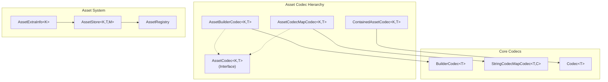
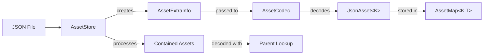

import { Aside, FileTree, Steps, Tabs, TabItem, Badge } from '@astrojs/starlight/components';

{/* [VERIFIED: 2026-02-19] */}

# Asset Codecs

Asset codecs extend the core codec system to support Hytale's asset loading pipeline. They handle asset identification, parent inheritance, tags, contained assets, and polymorphic asset types.

## Package Location

- `com.hypixel.hytale.assetstore.codec.AssetCodec`
- `com.hypixel.hytale.assetstore.codec.AssetBuilderCodec`
- `com.hypixel.hytale.assetstore.codec.AssetCodecMapCodec`
- `com.hypixel.hytale.assetstore.codec.ContainedAssetCodec`
- `com.hypixel.hytale.assetstore.AssetExtraInfo`
- `com.hypixel.hytale.assetstore.AssetRegistry`
- `com.hypixel.hytale.assetstore.AssetStore`

## Architecture



## AssetCodec\<K, T\> Interface

The base interface for all asset codecs. Extends `InheritCodec<T>` and `ValidatableCodec<T>`.

```java
package com.hypixel.hytale.assetstore.codec;

import com.hypixel.hytale.assetstore.AssetExtraInfo;
import com.hypixel.hytale.assetstore.JsonAsset;
import com.hypixel.hytale.codec.KeyedCodec;

public interface AssetCodec<K, T extends JsonAsset<K>> extends InheritCodec<T>, ValidatableCodec<T> {
    KeyedCodec<K> getKeyCodec();
    KeyedCodec<K> getParentCodec();
    AssetExtraInfo.Data getData(T asset);
    T decodeJsonAsset(RawJsonReader reader, AssetExtraInfo<K> extraInfo) throws IOException;
    T decodeAndInheritJsonAsset(RawJsonReader reader, T parent, AssetExtraInfo<K> extraInfo) throws IOException;
}
```

| Method | Description |
|--------|-------------|
| `getKeyCodec()` | Returns the `KeyedCodec` for the `"Id"` field |
| `getParentCodec()` | Returns the `KeyedCodec` for the `"Parent"` field |
| `getData(T)` | Gets the `AssetExtraInfo.Data` attached to the asset |
| `decodeJsonAsset(...)` | Decode a fresh asset from JSON |
| `decodeAndInheritJsonAsset(...)` | Decode with inheritance from a parent asset |

The type parameter `K` is the asset's key type (typically `String`) and `T` is the asset class which must extend `JsonAsset<K>`.

## AssetBuilderCodec\<K, T\>

Extends `BuilderCodec<T>` and implements `AssetCodec<K, T>`. This is the standard codec for single-type assets that are loaded from JSON files.

### Key Features

- Automatically manages `"Id"` and `"Parent"` fields
- Injects `AssetExtraInfo.Data` into decoded assets
- Inherits all `BuilderCodec` capabilities (fields, validation, versioning)
- Built-in `Tags` field with automatic tag inheritance and expansion

### Tags System

Every `AssetBuilderCodec` automatically includes a `Tags` field (type `Map<String, String[]>`). Tags are a general categorization mechanism:

```json
{
  "Tags": {
    "Material": ["Solid", "Stone"],
    "Ore": []
  }
}
```

Tags expand into a flat list automatically. The above example produces: `Ore`, `Material`, `Solid`, `Stone`, `Material=Solid`, `Material=Stone`. Tags are inherited from parent assets and merged.

### Creating an AssetBuilderCodec

```java
import com.hypixel.hytale.assetstore.codec.AssetBuilderCodec;
import com.hypixel.hytale.assetstore.AssetExtraInfo;
import com.hypixel.hytale.codec.Codec;
import com.hypixel.hytale.codec.KeyedCodec;

AssetBuilderCodec<String, MyAsset> CODEC = AssetBuilderCodec.builder(
        MyAsset.class,
        MyAsset::new,
        Codec.STRING,
        (asset, id) -> asset.id = id,
        asset -> asset.id,
        (asset, data) -> asset.data = data,
        asset -> asset.data
    )
    .append(
        new KeyedCodec<>("DisplayName", Codec.STRING),
        (asset, name) -> asset.displayName = name,
        asset -> asset.displayName
    )
    .add()
    .build();
```

### Builder Factory Methods

| Method | Description |
|--------|-------------|
| `AssetBuilderCodec.builder(class, supplier, idCodec, idSetter, idGetter, dataSetter, dataGetter)` | New asset codec |
| `AssetBuilderCodec.builder(class, supplier, parentCodec, idCodec, idSetter, idGetter, dataSetter, dataGetter)` | Asset codec with parent BuilderCodec |
| `AssetBuilderCodec.wrap(BuilderCodec, idCodec, idSetter, idGetter, dataSetter, dataGetter)` | Wrap an existing BuilderCodec as an asset codec |

### Decode Flow

<Steps>
1. Create instance via supplier
2. Inject `AssetExtraInfo.Data` via `dataSetter`
3. If parent exists, run `inherit()` to copy parent field values
4. Decode JSON fields via `decodeAndInheritJson0()`
5. Set the asset ID from `AssetExtraInfo.getKey()`
6. Run `afterDecodeAndValidate()` for validation
</Steps>

### Schema Generation

`AssetBuilderCodec` extends the schema with a `Parent` property that includes inheritance documentation. The schema indicates which root class the parent reference targets and supports the `InheritSettings` for tooling.

## AssetCodecMapCodec\<K, T\>

Extends `StringCodecMapCodec<T, AssetBuilderCodec<K, T>>` and implements `AssetCodec<K, T>`. Provides polymorphic asset dispatch based on a `"Type"` discriminator field.

### Usage

```java
import com.hypixel.hytale.assetstore.codec.AssetCodecMapCodec;
import com.hypixel.hytale.codec.Codec;

AssetCodecMapCodec<String, MyAsset> CODEC = new AssetCodecMapCodec<>(
    Codec.STRING,
    (asset, id) -> asset.id = id,
    asset -> asset.id,
    (asset, data) -> asset.data = data,
    asset -> asset.data
);

CODEC.register("TypeA", TypeAAsset.class, TypeAAsset.BUILDER_CODEC);
CODEC.register("TypeB", TypeBAsset.class, TypeBAsset.BUILDER_CODEC);
```

### How Registration Works

When `register()` is called with a `BuilderCodec`, the `AssetCodecMapCodec` automatically wraps it in an `AssetBuilderCodec` via `AssetBuilderCodec.wrap()`. This means you register plain `BuilderCodec` instances and the asset wrapping is handled internally.

### Type Resolution During Decoding

When decoding JSON, the codec:
1. Seeks the discriminator field (default `"Type"`) in the JSON
2. If no type field is found but a parent exists, uses the parent's registered type
3. Looks up the codec by type string
4. Falls back to the default codec if `allowDefault` is true
5. Delegates to the matched `AssetBuilderCodec` for actual decoding

### Constructor Variants

| Constructor | Description |
|-------------|-------------|
| `AssetCodecMapCodec(idCodec, idSetter, idGetter, dataSetter, dataGetter)` | Default `"Type"` key |
| `AssetCodecMapCodec(key, idCodec, ...)` | Custom discriminator key |
| `AssetCodecMapCodec(idCodec, ..., allowDefault)` | With default codec fallback |
| `AssetCodecMapCodec(key, idCodec, ..., allowDefault)` | Custom key and default fallback |

## ContainedAssetCodec\<K, T\>

A `Codec<K>` that handles assets embedded inline within other assets. Instead of decoding the contained asset immediately, it captures the raw JSON and registers it as a `RawAsset` for deferred processing by the `AssetStore`.

### Modes

| Mode | Description |
|------|-------------|
| `NONE` | Not allowed (throws `UnsupportedOperationException`) |
| `GENERATE_ID` | Generates a unique ID for the contained asset (prefixed with `*`) |
| `INHERIT_ID` | Uses the parent asset's key, transformed by the target asset store |
| `INHERIT_ID_AND_PARENT` | Inherits ID and also sets parent from the container's parent |
| `INJECT_PARENT` | Generates a unique ID but sets the container asset as the parent |

### Usage

```java
import com.hypixel.hytale.assetstore.codec.ContainedAssetCodec;

ContainedAssetCodec<String, MySubAsset> contained =
    new ContainedAssetCodec<>(MySubAsset.class, MySubAsset.CODEC);

ContainedAssetCodec<String, MySubAsset> withMode =
    new ContainedAssetCodec<>(MySubAsset.class, MySubAsset.CODEC,
        ContainedAssetCodec.Mode.INHERIT_ID);
```

### Behavior

When decoding:
- If the value is a **string**, it is treated as a reference to an existing asset (the key is decoded directly)
- If the value is an **object**, it is treated as an inline asset definition:
  1. The mode determines the ID assignment strategy
  2. The raw JSON is cloned and stored as a `RawAsset`
  3. The `RawAsset` is added to `AssetExtraInfo.Data.addContainedAsset()`
  4. The generated/inherited key is returned

This deferred loading allows the asset store to process contained assets after all top-level assets are loaded, resolving parent references correctly.

### JSON Examples

Reference to existing asset:
```json
{
  "SubAsset": "my_sub_asset"
}
```

Inline asset definition:
```json
{
  "SubAsset": {
    "Parent": "base_sub_asset",
    "CustomField": 42
  }
}
```

### Schema Output

The schema for a `ContainedAssetCodec` field produces an `anyOf` schema: either a string reference (key) or a nested object matching the asset codec's schema.

## AssetExtraInfo

`AssetExtraInfo<K>` extends `ExtraInfo` and carries asset-specific context through the decode process:

- `getKey()` - The asset's ID being decoded
- `getData()` - The `AssetExtraInfo.Data` for the current asset
- `getAssetPath()` - The file path of the JSON file being loaded
- `generateKey()` - Generate a unique key for contained assets (prefixed with `*`)

### AssetExtraInfo.Data

Tracks metadata for a decoded asset:

- Parent key tracking
- Contained asset collection (per asset class)
- Raw tag storage and tag expansion
- Source file path

## Integration with AssetStore

The asset codec system integrates with `AssetStore` and `AssetRegistry`:



1. `AssetStore` reads JSON files and creates `AssetExtraInfo` with the file path and asset key
2. The `AssetCodec` (either `AssetBuilderCodec` or `AssetCodecMapCodec`) decodes the JSON
3. Parent references (`"Parent"` field) trigger `decodeAndInherit` which copies fields from the parent asset
4. Contained assets are collected as `RawAsset` instances and processed in a second pass
5. Decoded assets are stored in the `AssetMap` and accessible via `AssetRegistry`

## Related

- [Serialization Overview](/plugin-development/serialization/overview/) - Core Codec\<T\> interface and built-in codecs
- [Component Codecs](/plugin-development/serialization/component-codecs/) - BuilderCodec, validation, versioning
- [Creating Custom Codecs](/plugin-development/serialization/custom-codecs/) - Step-by-step guide to building codecs
