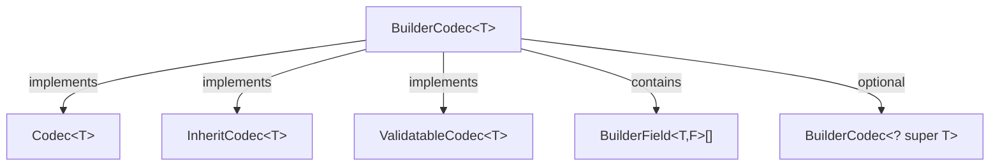

import { Aside, FileTree, Steps, Tabs, TabItem, Badge } from '@astrojs/starlight/components';

{/* [VERIFIED: 2026-02-19] */}

# Component Codecs

Component codecs handle the serialization of complex objects, collections, enums, and polymorphic type hierarchies. This page covers `BuilderCodec`, collection codecs, the validation system, versioning, and the `ProtocolCodecs` catalog.

## Package Location

- `com.hypixel.hytale.codec.builder.BuilderCodec`
- `com.hypixel.hytale.codec.builder.BuilderField`
- `com.hypixel.hytale.codec.lookup.CodecMapCodec`
- `com.hypixel.hytale.codec.lookup.StringCodecMapCodec`
- `com.hypixel.hytale.codec.codecs.EnumCodec`
- `com.hypixel.hytale.codec.codecs.array.ArrayCodec`
- `com.hypixel.hytale.codec.codecs.set.SetCodec`
- `com.hypixel.hytale.codec.codecs.map.MapCodec`
- `com.hypixel.hytale.codec.function.FunctionCodec`
- `com.hypixel.hytale.codec.validation.Validators`
- `com.hypixel.hytale.server.core.codec.ProtocolCodecs`

## BuilderCodec\<T\>

`BuilderCodec<T>` is the primary codec for serializing complex Java objects. It implements `Codec<T>`, `InheritCodec<T>`, and `ValidatableCodec<T>`, providing BSON/JSON serialization with field-level validation, versioning, and inheritance.



### Creating a BuilderCodec

Use the static factory methods to start building:

| Method | Description |
|--------|-------------|
| `BuilderCodec.builder(Class<T>, Supplier<T>)` | Concrete class with constructor |
| `BuilderCodec.builder(Class<T>, Supplier<T>, BuilderCodec<? super T>)` | Concrete class with parent codec |
| `BuilderCodec.abstractBuilder(Class<T>)` | Abstract class (no constructor) |
| `BuilderCodec.abstractBuilder(Class<T>, BuilderCodec<? super T>)` | Abstract class with parent codec |

### BuilderCodec.BuilderBase API

The builder returned by these methods provides a fluent API:

| Method | Description |
|--------|-------------|
| `append(KeyedCodec<F>, BiConsumer<T,F>, Function<T,F>)` | Add a field with setter and getter |
| `appendInherited(KeyedCodec<F>, BiConsumer<T,F>, Function<T,F>, BiConsumer<T,T>)` | Add field with inheritance callback |
| `versioned()` | Enable version tracking for this codec |
| `codecVersion(int)` | Set codec version (implies min version 0) |
| `codecVersion(int min, int max)` | Set explicit min and max version range |
| `afterDecode(Consumer<T>)` | Callback after decoding completes |
| `afterDecode(BiConsumer<T, ExtraInfo>)` | Callback with ExtraInfo access |
| `validator(BiConsumer<T, ValidationResults>)` | Codec-level validator |
| `documentation(String)` | Documentation string for schema generation |
| `metadata(Metadata)` | Attach metadata (e.g., `UIDisplayMode.COMPACT`) |
| `build()` | Build the final `BuilderCodec<T>` |

<Aside type="caution" title="Changed in Update 3">
The codec builder pattern changed from `addField(keyedCodec, setter, getter)` to `append(keyedCodec, setter, getter).add()`. The `append()` method returns a `FieldBuilder` that allows chaining validators, documentation, version ranges, and metadata before calling `.add()` to commit the field. The older `addField()` method is deprecated.
</Aside>

### BuilderField and FieldBuilder

Each field is defined through the `FieldBuilder` fluent API returned by `append()`:

```java
import com.hypixel.hytale.codec.Codec;
import com.hypixel.hytale.codec.KeyedCodec;
import com.hypixel.hytale.codec.builder.BuilderCodec;
import com.hypixel.hytale.codec.validation.Validators;

BuilderCodec.builder(MyClass.class, MyClass::new)
    .append(
        new KeyedCodec<>("Name", Codec.STRING),
        (obj, value) -> obj.name = value,
        obj -> obj.name
    )
    .addValidator(Validators.nonNull())
    .documentation("The display name")
    .add()
    .build();
```

| FieldBuilder Method | Description |
|---------------------|-------------|
| `addValidator(Validator<? super F>)` | Add a field-level validator |
| `addValidatorLate(Supplier<LateValidator>)` | Add a lazily-initialized validator |
| `setVersionRange(int min, int max)` | Restrict field to a version range |
| `documentation(String)` | Field documentation for schema |
| `metadata(Metadata)` | Attach metadata to the field |
| `add()` | Commit the field and return to the builder |

The `BuilderField` stores the `KeyedCodec`, setter (`TriConsumer<T, F, ExtraInfo>`), getter (`BiFunction<T, ExtraInfo, F>`), optional inherit callback, validators, version range, and documentation.

### Inheritance with appendInherited

For fields that should copy values from a parent during inheritance:

```java
import com.hypixel.hytale.codec.Codec;
import com.hypixel.hytale.codec.KeyedCodec;
import com.hypixel.hytale.codec.builder.BuilderCodec;

BuilderCodec.builder(MyClass.class, MyClass::new)
    .appendInherited(
        new KeyedCodec<>("Speed", Codec.FLOAT),
        (obj, speed) -> obj.speed = speed,
        obj -> obj.speed,
        (obj, parent) -> obj.speed = parent.speed
    )
    .add()
    .build();
```

When `decodeAndInherit()` is called, the inherit callback copies values from the parent before applying any overrides from the document being decoded.

### BuilderCodec Key Methods

| Method | Description |
|--------|-------------|
| `decode(BsonValue, ExtraInfo)` | Decode from BSON |
| `encode(T, ExtraInfo)` | Encode to BSON document |
| `decodeJson(RawJsonReader, ExtraInfo)` | Decode from JSON |
| `decodeAndInherit(BsonDocument, T, ExtraInfo)` | Decode with parent inheritance |
| `decodeAndInheritJson(RawJsonReader, T, ExtraInfo)` | JSON decode with inheritance |
| `getDefaultValue()` | Create instance with defaults and run afterDecode |
| `getParent()` | Get parent codec (or null) |
| `getEntries()` | Get field entries map |
| `getCodecVersion()` | Get current codec version |
| `validate(T, ExtraInfo)` | Run all field validators |
| `toSchema(SchemaContext)` | Generate JSON schema |

## Collection Codecs

### ArrayCodec\<T\>

Serializes Java arrays. Takes an element codec and an `IntFunction<T[]>` array constructor.

```java
import com.hypixel.hytale.codec.codecs.array.ArrayCodec;
import com.hypixel.hytale.codec.builder.BuilderCodec;

ArrayCodec<MyType> myTypeArray = new ArrayCodec<>(MyType.CODEC, MyType[]::new);

ArrayCodec<MyType> withDefault = ArrayCodec.ofBuilderCodec(MyType.CODEC, MyType[]::new);
```

`ArrayCodec.ofBuilderCodec()` creates an array codec that uses the builder's supplier as the default value for null elements.

### MapCodec\<V, M\>

Serializes `Map<String, V>` where keys are strings (matching JSON object structure).

```java
import com.hypixel.hytale.codec.Codec;
import com.hypixel.hytale.codec.codecs.map.MapCodec;
import java.util.HashMap;

MapCodec<Integer, HashMap<String, Integer>> intMap =
    new MapCodec<>(Codec.INTEGER, HashMap::new);

MapCodec<String, HashMap<String, String>> stringMap =
    new MapCodec<>(Codec.STRING, HashMap::new, false);
```

The third constructor parameter controls whether the resulting map is wrapped in `Collections.unmodifiableMap()` (default: `true`). A pre-built `STRING_HASH_MAP_CODEC` is available for `Map<String, String>`.

### SetCodec\<V, S\>

Serializes `Set<V>` as a JSON/BSON array with duplicate detection.

```java
import com.hypixel.hytale.codec.Codec;
import com.hypixel.hytale.codec.codecs.set.SetCodec;
import java.util.HashSet;

SetCodec<String, HashSet<String>> stringSet =
    new SetCodec<>(Codec.STRING, HashSet::new, true);
```

Throws `CodecException` if a duplicate value is encountered during decoding. The boolean parameter controls unmodifiability.

### EnumCodec\<T\>

Serializes Java enums as strings with automatic CamelCase formatting.

```java
import com.hypixel.hytale.codec.codecs.EnumCodec;

public enum MyEnum {
    FirstValue,
    SecondValue
}

EnumCodec<MyEnum> enumCodec = new EnumCodec<>(MyEnum.class);
```

`EnumCodec` auto-detects the naming style of the enum constants. If all constants are `UPPER_SNAKE_CASE`, it converts to CamelCase. If constants are already CamelCase, they are used as-is. Use `documentKey()` to add per-value documentation for schema generation:

```java
import com.hypixel.hytale.codec.codecs.EnumCodec;

EnumCodec<GameMode> gameModeCodec = new EnumCodec<>(GameMode.class)
    .documentKey(GameMode.Creative, "Makes the player invulnerable and grants flight.")
    .documentKey(GameMode.Adventure, "The normal gamemode for players.");
```

### FunctionCodec\<T, R\>

Transforms between a base codec type and a target type using encode/decode functions.

```java
import com.hypixel.hytale.codec.Codec;
import com.hypixel.hytale.codec.function.FunctionCodec;
import java.nio.file.Path;
import java.nio.file.Paths;

FunctionCodec<String, Path> pathCodec =
    new FunctionCodec<>(Codec.STRING, Paths::get, Path::toString);
```

The built-in `Codec.PATH`, `Codec.INSTANT`, `Codec.DURATION`, `Codec.DURATION_SECONDS`, `Codec.LOG_LEVEL`, and `Codec.UUID_STRING` are all `FunctionCodec` instances.

## Polymorphic Dispatch

### CodecMapCodec\<T\>

Dispatches decoding to different codecs based on a discriminator field in the JSON/BSON document.

```java
import com.hypixel.hytale.codec.lookup.CodecMapCodec;

CodecMapCodec<ActionConfig> actionCodec = new CodecMapCodec<>("Type");

actionCodec.register("Damage", DamageAction.class, DamageAction.CODEC);
actionCodec.register("Heal", HealAction.class, HealAction.CODEC);
```

| Constructor Parameter | Description |
|----------------------|-------------|
| `key` | Discriminator field name (default: `"Id"`) |
| `allowDefault` | Allow a default codec when no type matches |

When decoding JSON like `{"Type": "Damage", "Amount": 10}`, the codec reads the `"Type"` field, looks up `"Damage"` in its registry, and delegates to `DamageAction.CODEC`.

### StringCodecMapCodec\<T, C\>

The base class for string-keyed polymorphic dispatch. Uses `StampedLock` for thread-safe registration and a `StringTreeMap` for efficient key lookup during JSON parsing. `CodecMapCodec` extends this class.

### Registration Methods

| Method | Description |
|--------|-------------|
| `register(String, Class, Codec)` | Register with normal priority |
| `register(Priority, String, Class, Codec)` | Register with explicit priority |
| `remove(Class)` | Remove a registered codec |
| `getDefaultCodec()` | Get the default/fallback codec |
| `getIdFor(Class)` | Get the registered ID for a class |

Priority levels (`Priority.LOW`, `Priority.NORMAL`, `Priority.HIGH`) control the default codec selection when `allowDefault` is true.

## Validation System

### Validators

The `Validators` utility class provides factory methods for common validators:

| Method | Description |
|--------|-------------|
| `Validators.nonNull()` | Fails if value is null |
| `Validators.nonEmptyString()` | Fails if string is null or empty |
| `Validators.nonEmptyArray()` | Fails if array is null or empty |
| `Validators.nonEmptyMap()` | Fails if map is null or empty |
| `Validators.range(min, max)` | Value must be within range (inclusive) |
| `Validators.min(min)` | Value must be greater than or equal to min |
| `Validators.max(max)` | Value must be less than or equal to max |
| `Validators.greaterThan(value)` | Value must be greater than threshold |
| `Validators.greaterThanOrEqual(value)` | Value must be greater than or equal to threshold |
| `Validators.lessThan(value)` | Value must be less than threshold |
| `Validators.insideRange(min, max)` | Value must be within range (exclusive) |
| `Validators.equal(value)` | Value must equal the given value |
| `Validators.notEqual(value)` | Value must not equal the given value |
| `Validators.arraySize(size)` | Array must have exact size |
| `Validators.arraySizeRange(min, max)` | Array size must be within range |
| `Validators.uniqueInArray()` | All array elements must be unique |
| `Validators.nonNullArrayElements()` | No null elements in array |
| `Validators.deprecated()` | Marks the field as deprecated |
| `Validators.or(validators...)` | Any one validator must pass |
| `Validators.listItem(validator)` | Apply validator to each list element |

### Validator Interface

```java
package com.hypixel.hytale.codec.validation;

import com.hypixel.hytale.codec.schema.SchemaContext;
import com.hypixel.hytale.codec.schema.config.Schema;
import java.util.function.BiConsumer;

public interface Validator<T> extends BiConsumer<T, ValidationResults> {
    void accept(T value, ValidationResults results);
    void updateSchema(SchemaContext context, Schema target);
}
```

Validators both enforce constraints at decode time and contribute to JSON schema generation through `updateSchema()`.

### ValidationResults

Collects validation outcomes during decoding:

```java
package com.hypixel.hytale.codec.validation;

public class ValidationResults {
    public void fail(String reason);
    public void warn(String reason);
    public boolean hasFailed();
    public void logOrThrowValidatorExceptions(HytaleLogger logger);
}
```

| Result Level | Behavior |
|-------------|----------|
| `FAIL` | Throws `CodecValidationException` after processing |
| `WARNING` | Logged but does not halt decoding |
| `SUCCESS` | No action |

Validation runs automatically during `afterDecodeAndValidate()` which is called at the end of every decode path in `BuilderCodec`.

### LateValidator

A `LateValidator` defers validation until after all fields are decoded, useful for cross-field validation:

```java
import com.hypixel.hytale.codec.validation.LateValidator;
import com.hypixel.hytale.codec.validation.ValidationResults;
import com.hypixel.hytale.codec.ExtraInfo;

.addValidatorLate(() -> new LateValidator<MyType>() {
    public void accept(MyType value, ValidationResults results) {}

    public void acceptLate(MyType value, ValidationResults results, ExtraInfo extraInfo) {
        if (value != null && !value.isValid()) {
            results.fail("Value failed late validation");
        }
    }
})
```

## Versioning

`BuilderCodec` supports schema evolution through versioned fields. When versioning is enabled, a `"Version"` field is read from the document and used to select the appropriate field definition.

### Enabling Versioning

```java
import com.hypixel.hytale.codec.Codec;
import com.hypixel.hytale.codec.KeyedCodec;
import com.hypixel.hytale.codec.builder.BuilderCodec;

BuilderCodec<MyConfig> CODEC = BuilderCodec.builder(MyConfig.class, MyConfig::new)
    .append(
        new KeyedCodec<>("OldField", Codec.STRING),
        (obj, v) -> obj.oldField = v,
        obj -> obj.oldField
    )
    .setVersionRange(0, 1)
    .add()

    .append(
        new KeyedCodec<>("NewField", Codec.INTEGER),
        (obj, v) -> obj.newField = v,
        obj -> obj.newField
    )
    .setVersionRange(2, Integer.MAX_VALUE)
    .add()

    .versioned()
    .codecVersion(2)
    .build();
```

### Version Constants

| Constant | Value | Description |
|----------|-------|-------------|
| `BuilderCodec.UNSET_VERSION` | `Integer.MIN_VALUE` | No version set |
| `BuilderCodec.UNSET_MAX_VERSION` | `Integer.MAX_VALUE` | No max version |
| `BuilderCodec.INITIAL_VERSION` | `0` | Starting version |

### Version Behavior

- If `versioned()` is set, a `"Version"` integer field is read/written automatically
- If the document version is newer than `codecVersion`, an `IllegalArgumentException` is thrown
- If the document version is older than `minCodecVersion`, an `IllegalArgumentException` is thrown
- Each field's `setVersionRange(min, max)` controls which version it applies to
- When multiple fields share the same key with different version ranges, the first matching field is used
- Parent codec versions are incorporated: max version is the higher of parent/child, min version is the lower

### Version in JSON

```json
{
  "Version": 2,
  "NewField": 42
}
```

## ProtocolCodecs Catalog

`ProtocolCodecs` provides pre-built codecs for common protocol types used throughout the server.

### Geometry and Spatial

| Codec | Type | Fields |
|-------|------|--------|
| `DIRECTION` | `Direction` | Yaw, Pitch, Roll (floats) |
| `VECTOR2F` | `Vector2f` | X, Y (floats) |
| `VECTOR3F` | `Vector3f` | X, Y, Z (floats) |
| `SIZE` | `Size` | Width, Height (integers) |

### Color

| Codec | Type | Description |
|-------|------|-------------|
| `COLOR` | `Color` | RGB color (hex string) |
| `COLOR_AlPHA` | `Color` | RGBA color with alpha |
| `COLOR_ARRAY` | `Color[]` | Array of colors |
| `COLOR_LIGHT` | `ColorLight` | Color with Radius field |

### Ranges

| Codec | Type | Fields |
|-------|------|--------|
| `RANGE` | `Range` | Min, Max (integers) |
| `RANGEB` | `Rangeb` | Min, Max (bytes) |
| `RANGEF` | `Rangef` | Min, Max (doubles as floats) |
| `RANGE_VECTOR2F` | `RangeVector2f` | X, Y (Rangef) |
| `RANGE_VECTOR3F` | `RangeVector3f` | X, Y, Z (Rangef) |

### Enums

| Codec | Type | Description |
|-------|------|-------------|
| `GAMEMODE` | `GameMode` | Creative, Adventure |
| `CHANGE_STAT_BEHAVIOUR_CODEC` | `ChangeStatBehaviour` | Add, Set |
| `ACCUMULATION_MODE_CODEC` | `AccumulationMode` | Set, Sum, Average |
| `EASING_TYPE_CODEC` | `EasingType` | Easing function types |
| `CHANGE_VELOCITY_TYPE_CODEC` | `ChangeVelocityType` | Add, Set |

### Complex Types

| Codec | Type | Description |
|-------|------|-------------|
| `INITIAL_VELOCITY` | `InitialVelocity` | Yaw, Pitch, Speed (Rangef) |
| `UV_MOTION` | `UVMotion` | Texture animation parameters |
| `INTERSECTION_HIGHLIGHT` | `IntersectionHighlight` | Threshold and color |
| `SAVED_MOVEMENT_STATES` | `SavedMovementStates` | Flying boolean |
| `ITEM_ANIMATION_CODEC` | `ItemAnimation` | First/third person animations |
| `RAIL_POINT_CODEC` | `RailPoint` | Point and Normal (Vector3f) |
| `RAIL_CONFIG_CODEC` | `RailConfig` | Array of RailPoints (2-16) |

## Related

- [Serialization Overview](/plugin-development/serialization/overview/) - Core Codec\<T\> interface and built-in codecs
- [Asset Codecs](/plugin-development/serialization/asset-codecs/) - AssetBuilderCodec and asset-specific serialization
- [Creating Custom Codecs](/plugin-development/serialization/custom-codecs/) - Step-by-step guide to building codecs
