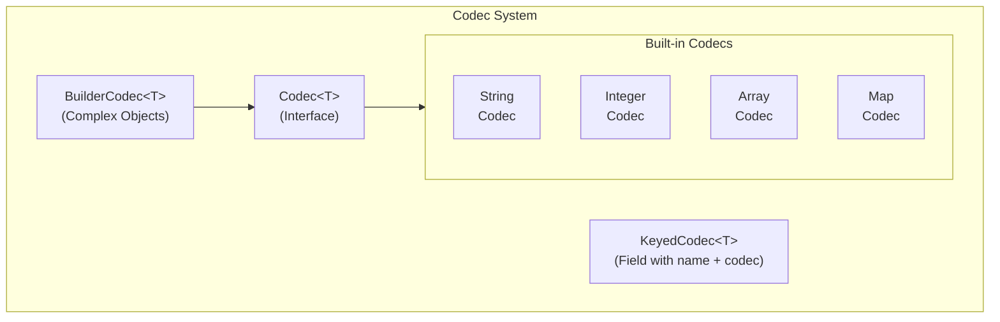

import { Aside, FileTree, Steps, Tabs, TabItem, Badge } from '@astrojs/starlight/components';

{/* [VERIFIED: 2026-02-13] */}

# Serialization (Codec) System Overview

The Codec System provides serialization and deserialization for BSON and JSON formats. It uses a type-safe, builder-based approach with support for versioning, validation, and polymorphism.

## Package Location

`com.hypixel.hytale.codec`

- Core: `codec/`
- Builders: `codec/builder/`
- Built-in Codecs: `codec/codecs/`
- Validation: `codec/validation/`

## Architecture



## Core Interfaces

### Codec\<T\>

The main serialization interface:

```java
package com.hypixel.hytale.codec;

public interface Codec<T> extends RawJsonCodec<T>, SchemaConvertable<T> {
    // Decode from BSON
    T decode(BsonValue bsonValue, ExtraInfo extraInfo);

    // Encode to BSON
    BsonValue encode(T value, ExtraInfo extraInfo);

    // Decode from JSON
    T decodeJson(RawJsonReader reader, ExtraInfo extraInfo) throws IOException;

    // Generate JSON schema
    Schema toSchema(SchemaContext context);
}
```

### KeyedCodec\<T\>

Wraps a codec with a field name:

```java
package com.hypixel.hytale.codec;

public class KeyedCodec<T> {
    public KeyedCodec(String key, Codec<T> codec);

    // get value from document (returns Optional.empty() if missing)
    public Optional<T> get(BsonDocument doc, ExtraInfo info);

    // get value from document (throws if missing)
    public T getNow(BsonDocument doc, ExtraInfo info);

    // get value or null if missing
    public T getOrNull(BsonDocument doc, ExtraInfo info);

    // get with default value
    public T getOrDefault(BsonDocument doc, ExtraInfo info, T defaultValue);

    // put value into document
    public void put(BsonDocument doc, T value, ExtraInfo info);
}
```

Key names must start with an uppercase letter.

## Built-in Codecs

### Primitive Codecs

| Codec | Java Type | Usage |
|-------|-----------|-------|
| `Codec.STRING` | `String` | Text values |
| `Codec.BOOLEAN` | `Boolean` | True/false |
| `Codec.INTEGER` | `Integer` | 32-bit integers |
| `Codec.LONG` | `Long` | 64-bit integers |
| `Codec.FLOAT` | `Float` | 32-bit floats |
| `Codec.DOUBLE` | `Double` | 64-bit doubles |
| `Codec.BYTE` | `Byte` | 8-bit integers |
| `Codec.SHORT` | `Short` | 16-bit integers |

### Array Codecs

| Codec | Java Type |
|-------|-----------|
| `Codec.STRING_ARRAY` | `String[]` |
| `Codec.INT_ARRAY` | `int[]` |
| `Codec.LONG_ARRAY` | `long[]` |
| `Codec.FLOAT_ARRAY` | `float[]` |
| `Codec.DOUBLE_ARRAY` | `double[]` |

### Utility Codecs

| Codec | Java Type | Description |
|-------|-----------|-------------|
| `Codec.UUID_BINARY` | `UUID` | Binary UUID format |
| `Codec.UUID_STRING` | `UUID` | String UUID format |
| `Codec.PATH` | `Path` | File path |
| `Codec.INSTANT` | `Instant` | Timestamp |
| `Codec.DURATION` | `Duration` | Time duration (string) |
| `Codec.DURATION_SECONDS` | `Duration` | Time duration (seconds) |

### Collection Codecs

```java
// Map with string keys
new MapCodec<>(valueCodec, HashMap::new);

// Array of objects
new ArrayCodec<>(elementCodec, defaultArray);

// Set of values
new SetCodec<>(valueCodec, HashSet::new);

// Enum values
new EnumCodec<>(MyEnum.class);
```

## BuilderCodec

<Aside type="caution" title="Changed in Update 3">
`BuilderCodec.decodeJson0` was changed from `public` to `private`. Version decoding now happens before field decoding across all decode paths (BsonDocument, JSON, BSON reader), ensuring version-dependent codec logic is resolved before any field processing. All serialization changes are documented in the [Update 3 changelog](/changelog/update-2-to-3/).
</Aside>

For complex object serialization:

```java
package com.hypixel.hytale.codec.builder;

public class BuilderCodec<T> implements Codec<T> {
    // Create builder for concrete class
    public static <T> BuilderCodecBuilder<T> builder(
        Class<T> clazz,
        Supplier<T> constructor
    );

    // Create builder with parent codec (inheritance)
    public static <T> BuilderCodecBuilder<T> builder(
        Class<T> clazz,
        Supplier<T> constructor,
        BuilderCodec<? super T> parent
    );

    // Create builder for abstract class
    public static <T> BuilderCodecBuilder<T> abstractBuilder(Class<T> clazz);
}
```

### BuilderCodecBuilder

Fluent API for defining codecs:

```java
BuilderCodec.builder(MyClass.class, MyClass::new)
    // Add field
    .append(
        new KeyedCodec<>("FieldName", Codec.STRING),
        (obj, value) -> obj.field = value,  // Setter
        obj -> obj.field                     // Getter
    )
    .documentation("Field description")
    .addValidator(Validators.nonNull())
    .add()

    // Add more fields...

    // Enable versioning
    .versioned()
    .codecVersion(1)

    // Build final codec
    .build();
```

<Aside type="caution" title="Changed in Update 3">
The codec builder pattern changed from `codec.addField("name", getter, setter)` to `codec.append(keyedCodec, setter, getter).add()`. This affects virtually all config classes that define codecs. If you are extending codec definitions, update your builder calls to use the new `append().add()` pattern. See the [Update 3 changelog](/changelog/update-2-to-3/) for additional breaking changes.
</Aside>

## Creating Custom Codecs

### Simple Object

```java
import com.hypixel.hytale.codec.Codec;
import com.hypixel.hytale.codec.KeyedCodec;
import com.hypixel.hytale.codec.builder.BuilderCodec;
import com.hypixel.hytale.codec.validation.Validators;

public class MyConfig {
    public String name;
    public float value;
    public boolean enabled;

    public static final BuilderCodec<MyConfig> CODEC =
        BuilderCodec.builder(MyConfig.class, MyConfig::new)
            .append(
                new KeyedCodec<>("Name", Codec.STRING),
                (config, name) -> config.name = name,
                config -> config.name
            )
            .addValidator(Validators.nonNull())
            .documentation("Configuration name")
            .add()

            .append(
                new KeyedCodec<>("Value", Codec.FLOAT),
                (config, value) -> config.value = value,
                config -> config.value
            )
            .documentation("Numeric value")
            .add()

            .append(
                new KeyedCodec<>("Enabled", Codec.BOOLEAN),
                (config, enabled) -> config.enabled = enabled,
                config -> config.enabled
            )
            .add()

            .build();
}
```

### With Inheritance

```java
public abstract class BaseConfig {
    public String id;

    public static final BuilderCodec<BaseConfig> BASE_CODEC =
        BuilderCodec.abstractBuilder(BaseConfig.class)
            .appendInherited(
                new KeyedCodec<>("Id", Codec.STRING),
                (obj, id) -> obj.id = id,
                obj -> obj.id,
                (obj, parent) -> obj.id = parent.id
            )
            .addValidator(Validators.nonNull())
            .add()
            .build();
}

public class DerivedConfig extends BaseConfig {
    public int level;

    public static final BuilderCodec<DerivedConfig> CODEC =
        BuilderCodec.builder(DerivedConfig.class, DerivedConfig::new,
            BaseConfig.BASE_CODEC)
            .append(
                new KeyedCodec<>("Level", Codec.INTEGER),
                (obj, level) -> obj.level = level,
                obj -> obj.level
            )
            .add()
            .build();
}
```

### Polymorphic Types

```java
import com.hypixel.hytale.codec.lookup.CodecMapCodec;

public abstract class ActionConfig {
    // Polymorphic dispatch by "Type" field
    public static final CodecMapCodec<ActionConfig> CODEC =
        new CodecMapCodec<>("Type");

    public static final BuilderCodec<ActionConfig> BASE_CODEC =
        BuilderCodec.abstractBuilder(ActionConfig.class)
            .build();
}

public class DamageActionConfig extends ActionConfig {
    public float damage;

    public static final BuilderCodec<DamageActionConfig> CODEC =
        BuilderCodec.builder(DamageActionConfig.class, DamageActionConfig::new,
            ActionConfig.BASE_CODEC)
            .append(
                new KeyedCodec<>("Damage", Codec.FLOAT),
                (obj, damage) -> obj.damage = damage,
                obj -> obj.damage
            )
            .add()
            .build();

    // Register this type
    static {
        ActionConfig.CODEC.register("Damage", DamageActionConfig.class,
            DamageActionConfig.CODEC);
    }
}
```

JSON usage:
```json
{
  "Type": "Damage",
  "Damage": 10.0
}
```

## Validation

Built-in validators:

```java
import com.hypixel.hytale.codec.validation.Validators;

// Non-null validation
.addValidator(Validators.nonNull())

// Range validation
.addValidator(Validators.range(0.0, 100.0))

// Greater than
.addValidator(Validators.greaterThan(0))

// Less than
.addValidator(Validators.lessThan(1000))

// Custom validation
.addValidator((value, info) -> {
    if (!isValid(value)) {
        throw new ValidationException("Invalid value");
    }
})
```

## Versioning

Support for schema evolution:

```java
BuilderCodec.builder(MyClass.class, MyClass::new)
    // Field added in version 1
    .append(new KeyedCodec<>("OldField", Codec.STRING), ...)
    .codecVersion(1, 2)  // Versions 1-2
    .add()

    // Field added in version 2
    .append(new KeyedCodec<>("NewField", Codec.INTEGER), ...)
    .codecVersion(2)  // Version 2+
    .add()

    .versioned()
    .build();
```

## ExtraInfo Context

Context passed during serialization:

```java
package com.hypixel.hytale.codec;

public class ExtraInfo {
    // thread-local instance
    public static final ThreadLocal<ExtraInfo> THREAD_LOCAL;

    // push/pop keys to track current decode path
    public void pushKey(String key);
    public void popKey();

    // peek at current path, line, and column
    public String peekKey();
    public int peekLine();
    public int peekColumn();

    // track unknown keys encountered during decode
    public void addUnknownKey(String key);
    public List<String> getUnknownKeys();

    // access validation results
    public ValidationResults getValidationResults();
}
```

## Using Codecs

### Encoding (Object to BSON)

```java
import org.bson.BsonValue;
import com.hypixel.hytale.codec.ExtraInfo;

MyConfig config = new MyConfig();
config.name = "Test";
config.value = 42.0f;
config.enabled = true;

BsonValue bson = MyConfig.CODEC.encode(config, ExtraInfo.get());
```

### Decoding (BSON to Object)

```java
import org.bson.BsonDocument;
import com.hypixel.hytale.codec.ExtraInfo;

BsonDocument doc = BsonDocument.parse("{\"Name\": \"Test\", \"Value\": 42.0}");

MyConfig config = MyConfig.CODEC.decode(doc, ExtraInfo.get());
```

### JSON Decoding

```java
import com.hypixel.hytale.codec.json.RawJsonReader;
import java.io.StringReader;

String json = "{\"Name\": \"Test\", \"Value\": 42.0}";
RawJsonReader reader = new RawJsonReader(new StringReader(json));

MyConfig config = MyConfig.CODEC.decodeJson(reader, ExtraInfo.get());
```

## Best Practices

1. **Use KeyedCodec**: Always use uppercase field names
2. **Add validators**: Validate required fields with `Validators.nonNull()`
3. **Document fields**: Use `.documentation()` for clarity
4. **Version your codecs**: Enable versioning for evolution
5. **Register polymorphic types**: Use `CodecMapCodec` for type dispatch
6. **Reuse codecs**: Store codecs as `static final` fields

## Related

- [Asset System](/asset-development/overview/) - Asset serialization
- [Plugin Manifest](/getting-started/plugin-manifest/) - Manifest format
- [Registries](/plugin-development/core-concepts/registries/) - Codec registration
