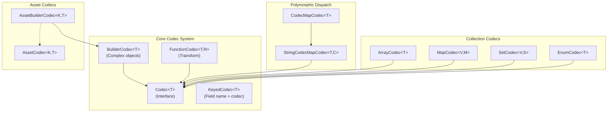

import { Aside, FileTree, Steps, Tabs, TabItem, Badge } from '@astrojs/starlight/components';

{/* [VERIFIED: 2026-02-19] */}

# Serialization (Codec) System Overview

The Codec System provides serialization and deserialization for BSON and JSON formats. It uses a type-safe, builder-based approach with support for versioning, validation, polymorphism, and automatic JSON schema generation.

## Package Location

- Core: `com.hypixel.hytale.codec`
- Builders: `com.hypixel.hytale.codec.builder`
- Built-in Codecs: `com.hypixel.hytale.codec.codecs`
- Validation: `com.hypixel.hytale.codec.validation`
- Asset Codecs: `com.hypixel.hytale.assetstore.codec`
- Protocol Codecs: `com.hypixel.hytale.server.core.codec`

## Why Use Codecs?

- **Type safety** - Compile-time checked serialization with generics
- **Dual format support** - Single codec handles both BSON and JSON
- **Validation** - Built-in validators enforce constraints at decode time
- **Versioning** - Schema evolution with field-level version ranges
- **Schema generation** - Automatic JSON schema output via `toSchema()`
- **Inheritance** - Parent/child codec relationships with field merging
- **Polymorphism** - Type dispatch via discriminator fields

## Architecture



## Core Interfaces

### Codec\<T\>

The main serialization interface. Every codec implements three operations: decode from BSON, encode to BSON, and decode from JSON.

```java
package com.hypixel.hytale.codec;

import com.hypixel.hytale.codec.schema.SchemaConvertable;
import com.hypixel.hytale.codec.util.RawJsonReader;
import org.bson.BsonValue;
import java.io.IOException;

public interface Codec<T> extends RawJsonCodec<T>, SchemaConvertable<T> {
    T decode(BsonValue bsonValue, ExtraInfo extraInfo);

    BsonValue encode(T value, ExtraInfo extraInfo);

    T decodeJson(RawJsonReader reader, ExtraInfo extraInfo) throws IOException;
}
```

### KeyedCodec\<T\>

Wraps a `Codec<T>` with a named key for use as a field within a `BsonDocument`. Key names **must** start with an uppercase letter.

```java
package com.hypixel.hytale.codec;

import org.bson.BsonDocument;
import java.util.Optional;

public class KeyedCodec<T> {
    public KeyedCodec(String key, Codec<T> codec);
    public KeyedCodec(String key, Codec<T> codec, boolean required);
}
```

| Method | Return Type | Description |
|--------|-------------|-------------|
| `get(BsonDocument, ExtraInfo)` | `Optional<T>` | Get value, empty if missing |
| `getNow(BsonDocument, ExtraInfo)` | `T` | Get value, throws if missing |
| `getOrNull(BsonDocument, ExtraInfo)` | `T` | Get value or null |
| `getOrDefault(BsonDocument, ExtraInfo, T)` | `T` | Get value or default |
| `getAndInherit(BsonDocument, T, ExtraInfo)` | `Optional<T>` | Get with parent inheritance |
| `put(BsonDocument, T, ExtraInfo)` | `void` | Encode and put into document |
| `getKey()` | `String` | Get the field name |
| `getChildCodec()` | `Codec<T>` | Get the wrapped codec |
| `isRequired()` | `boolean` | Whether the field is required |

## Built-in Codecs

### Primitive Codecs

| Codec | Java Type | Description |
|-------|-----------|-------------|
| `Codec.STRING` | `String` | Text values |
| `Codec.BOOLEAN` | `Boolean` | True/false |
| `Codec.INTEGER` | `Integer` | 32-bit integers |
| `Codec.LONG` | `Long` | 64-bit integers |
| `Codec.FLOAT` | `Float` | 32-bit floats |
| `Codec.DOUBLE` | `Double` | 64-bit doubles |
| `Codec.BYTE` | `Byte` | 8-bit integers |
| `Codec.SHORT` | `Short` | 16-bit integers |

### Array Codecs

| Codec | Java Type |
|-------|-----------|
| `Codec.STRING_ARRAY` | `String[]` |
| `Codec.INT_ARRAY` | `int[]` |
| `Codec.LONG_ARRAY` | `long[]` |
| `Codec.FLOAT_ARRAY` | `float[]` |
| `Codec.DOUBLE_ARRAY` | `double[]` |

### Utility Codecs

| Codec | Java Type | Description |
|-------|-----------|-------------|
| `Codec.UUID_BINARY` | `UUID` | Binary UUID format |
| `Codec.UUID_STRING` | `UUID` | String UUID format |
| `Codec.PATH` | `Path` | File path (via `FunctionCodec`) |
| `Codec.INSTANT` | `Instant` | ISO-8601 timestamp |
| `Codec.DURATION` | `Duration` | ISO-8601 duration string |
| `Codec.DURATION_SECONDS` | `Duration` | Duration as seconds (double) |
| `Codec.LOG_LEVEL` | `Level` | Java logging level |

## ExtraInfo Context

`ExtraInfo` carries context through the entire encode/decode process. It tracks the current decode path, manages validation results, and provides thread-local access.

```java
package com.hypixel.hytale.codec;

import com.hypixel.hytale.codec.validation.ValidationResults;
import java.util.List;

public class ExtraInfo {
    public static final ThreadLocal<ExtraInfo> THREAD_LOCAL;

    public void pushKey(String key);
    public void popKey();
    public String peekKey();
    public int peekLine();
    public int peekColumn();

    public int getVersion();
    public int getKeysSize();

    public void addUnknownKey(String key);
    public List<String> getUnknownKeys();

    public ValidationResults getValidationResults();
}
```

The path tracking (`pushKey`/`popKey`) produces dot-separated paths like `"MyField.SubField.0"` that appear in error messages, making it easy to locate problems in deeply nested structures.

<Aside type="caution" title="Changed in Update 3">
`BuilderCodec.decodeJson0` was changed from `public` to `private`. Version decoding now happens before field decoding across all decode paths (BSON, JSON, BSON reader), ensuring version-dependent codec logic is resolved before any field processing. The builder pattern also changed from `addField(keyedCodec, setter, getter)` to `append(keyedCodec, setter, getter).add()`. See the [Update 3 changelog](/changelog/update-2-to-3/) for all breaking changes.
</Aside>

## Related

- [Component Codecs](/plugin-development/serialization/component-codecs/) - BuilderCodec, collection codecs, validation, versioning, and ProtocolCodecs
- [Asset Codecs](/plugin-development/serialization/asset-codecs/) - AssetBuilderCodec, AssetCodecMapCodec, and ContainedAssetCodec
- [Creating Custom Codecs](/plugin-development/serialization/custom-codecs/) - Step-by-step guide to building your own codecs
- [Registries](/plugin-development/core-concepts/registries/) - Codec registration in the registry system
