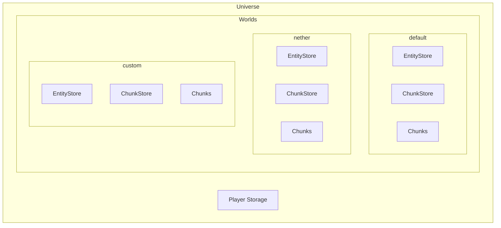
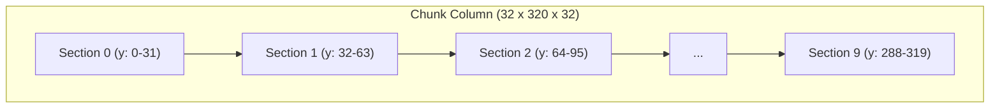

{/* [VERIFIED: 2026-02-13] */}

import { Aside, FileTree, Steps, Tabs, TabItem, Badge } from '@astrojs/starlight/components';

# World System Overview

The World System manages the game universe, individual worlds, chunks, blocks, and lighting. It provides the spatial foundation for all gameplay.

## Package Location

- Universe: `com.hypixel.hytale.server.core.universe.Universe`
- World: `com.hypixel.hytale.server.core.universe.world.World`
- WorldConfig: `com.hypixel.hytale.server.core.universe.world.WorldConfig`
- EntityStore: `com.hypixel.hytale.server.core.universe.world.storage.EntityStore`
- ChunkStore: `com.hypixel.hytale.server.core.universe.world.storage.ChunkStore`
- ChunkUtil: `com.hypixel.hytale.math.util.ChunkUtil`

## Architecture



## Universe

The `Universe` class is the top-level container for all worlds and player data. It extends `JavaPlugin`.

### Accessing the Universe

```java
import com.hypixel.hytale.server.core.universe.Universe;

Universe universe = Universe.get();
```

### Key Methods

| Method | Return Type | Description |
|--------|-------------|-------------|
| `get()` | `Universe` | Get the singleton universe instance |
| `getWorlds()` | `Map<String, World>` | Get all loaded worlds (unmodifiable) |
| `getWorld(String)` | `World` | Get world by name (case-insensitive) |
| `getWorld(UUID)` | `World` | Get world by UUID |
| `getDefaultWorld()` | `World` | Get the default world |
| `getPlayers()` | `List<PlayerRef>` | Get all online players |
| `getPlayer(UUID)` | `PlayerRef` | Get player by UUID |
| `getPlayerByUsername(String, NameMatching)` | `PlayerRef` | Find player by username |
| `getPlayerStorage()` | `PlayerStorage` | Access player data storage |
| `getPlayerCount()` | `int` | Get total online player count |

### World Management

```java
Map<String, World> worlds = universe.getWorlds();

World netherWorld = universe.getWorld("nether");

World defaultWorld = universe.getDefaultWorld();

if (universe.getWorlds().containsKey("custom")) {
    // world exists
}
```

<Aside type="tip">
`addWorld(String)` returns a `CompletableFuture<World>` -- world creation is async. There is also `loadWorld(String)` for loading an existing world from disk, and `makeWorld(String, Path, WorldConfig)` if you need to supply your own config.
</Aside>

### Player Access

```java
for (PlayerRef player : universe.getPlayers()) {
    // process each player
}

PlayerRef player = universe.getPlayerByUsername("username", NameMatching.DEFAULT);
```

## World

Each `World` represents a separate game world with its own chunks, entities, and rules. World extends `TickingThread` and implements `Executor`, so it runs on its own dedicated thread.

### Accessing a World

```java
World world = Universe.get().getWorld("default");

World world = Universe.get().getDefaultWorld();
```

### Key Properties

| Property | Type | Description |
|----------|------|-------------|
| `getName()` | `String` | World's unique name |
| `getSavePath()` | `Path` | Filesystem path for world data |
| `getWorldConfig()` | `WorldConfig` | World configuration |
| `getEntityStore()` | `EntityStore` | Entity ECS store |
| `getChunkStore()` | `ChunkStore` | Chunk ECS store |
| `getTick()` | `long` | Current world tick |
| `isTicking()` | `boolean` | Whether the world is ticking |
| `isPaused()` | `boolean` | Whether the world is paused |
| `isAlive()` | `boolean` | Whether the world is still running |
| `getPlayerCount()` | `int` | Number of players in this world |

### World Methods

```java
String name = world.getName();

EntityStore entityStore = world.getEntityStore();
ChunkStore chunkStore = world.getChunkStore();

long tick = world.getTick();

boolean ticking = world.isTicking();
boolean paused = world.isPaused();

long seed = world.getWorldConfig().getSeed();
```

### Player Management

```java
Collection<PlayerRef> players = world.getPlayerRefs();

int playerCount = world.getPlayerCount();

world.sendMessage(Message.raw("Hello everyone!"));
```

### Block Operations

```java
int blockId = world.getBlock(x, y, z);

BlockType blockType = world.getBlockType(x, y, z);

world.setBlock(x, y, z, blockType);
```

<Aside type="caution">
Block operations on `World` use global coordinates and work through the `ChunkAccessor` interface. Always make sure the target chunk is loaded before reading or writing blocks.
</Aside>

### Chunk Operations

Chunks in Hytale are addressed by a `long` index. Use `ChunkUtil` to convert between block coordinates and chunk indices.

```java
import com.hypixel.hytale.math.util.ChunkUtil;

long chunkIndex = ChunkUtil.indexChunk(chunkX, chunkZ);

WorldChunk chunk = world.getChunk(chunkIndex);

long fromBlock = ChunkUtil.indexChunkFromBlock(blockX, blockZ);
WorldChunk chunk = world.getChunk(fromBlock);

WorldChunk loaded = world.getChunkIfLoaded(chunkIndex);

CompletableFuture<WorldChunk> future = world.getChunkAsync(chunkX, chunkZ);
```

| Method | Description |
|--------|-------------|
| `getChunk(long)` | Get chunk synchronously (loads if needed) |
| `getChunkIfLoaded(long)` | Get chunk only if it's loaded and ticking |
| `getChunkIfInMemory(long)` | Get chunk if it's in memory (any state) |
| `getChunkAsync(long)` | Load chunk asynchronously |
| `getChunkAsync(int, int)` | Load chunk asynchronously by chunk coords |
| `getNonTickingChunkAsync(long)` | Get chunk without marking it as ticking |

## World Configuration

`WorldConfig` defines how a world behaves.

### Key Configuration Options

| Option | Type | Description |
|--------|------|-------------|
| `seed` | `long` | World generation seed |
| `gameTime` | `Instant` | Current game time |
| `isTicking` | `boolean` | Whether chunks tick |
| `isBlockTicking` | `boolean` | Whether blocks tick |
| `isPvpEnabled` | `boolean` | Whether PvP is enabled |
| `isFallDamageEnabled` | `boolean` | Whether fall damage is active |
| `isGameTimePaused` | `boolean` | Whether day/night cycle is paused |
| `worldGenProvider` | `IWorldGenProvider` | World generator |
| `chunkStorageProvider` | `IChunkStorageProvider` | Chunk storage type |
| `spawnProvider` | `ISpawnProvider` | Spawn location logic |
| `gameplayConfig` | `String` | GameplayConfig asset reference |
| `forcedWeather` | `String` | Forced weather type |
| `gameMode` | `GameMode` | Default gamemode |

### World Generator Providers

| Provider | Key | Description |
|----------|-----|-------------|
| `FlatWorldGenProvider` | `"Flat"` | Flat world generation |
| `VoidWorldGenProvider` | `"Void"` | Empty void world (default) |
| `DummyWorldGenProvider` | `"Dummy"` | No generation |

### Chunk Storage Providers

| Provider | Key | Description |
|----------|-----|-------------|
| `DefaultChunkStorageProvider` | `"Hytale"` | Default file-based storage |
| `EmptyChunkStorageProvider` | `"Empty"` | No persistence |
| `IndexedStorageChunkStorageProvider` | `"IndexedStorage"` | Optimized indexed storage |
| `MigrationChunkStorageProvider` | `"Migration"` | Migration support |

### Spawn Providers

| Provider | Key | Description |
|----------|-----|-------------|
| `GlobalSpawnProvider` | `"Global"` | Single spawn point for all |
| `IndividualSpawnProvider` | `"Individual"` | Per-player spawn points |
| `FitToHeightMapSpawnProvider` | `"FitToHeightMap"` | Spawn on terrain surface |

## Entity Store & Chunk Store

Each world has two ECS stores:

### EntityStore

For world entities (players, mobs, items):

```java
EntityStore entityStore = world.getEntityStore();
Store<EntityStore> store = entityStore.getStore();

Holder<EntityStore> holder = EntityStore.REGISTRY.newHolder();
holder.addComponent(positionType, new PositionComponent(x, y, z));
Ref<EntityStore> ref = store.addEntity(holder, AddReason.SPAWN);
```

### ChunkStore

For chunk-level data (blocks, sections, lighting, environment):

```java
ChunkStore chunkStore = world.getChunkStore();
Store<ChunkStore> store = chunkStore.getStore();
```

## World Events

### World Lifecycle Events

```java
getEventRegistry().register(StartWorldEvent.class, event -> {
    World world = event.getWorld();
});

getEventRegistry().register(AddWorldEvent.class, event -> {
    World world = event.getWorld();
});

getEventRegistry().register(RemoveWorldEvent.class, event -> {
    World world = event.getWorld();
});

getEventRegistry().register(AllWorldsLoadedEvent.class, event -> {
    // server fully initialized
});
```

### Player World Events

```java
getEventRegistry().register(AddPlayerToWorldEvent.class, event -> {
    World world = event.getWorld();
    PlayerRef player = event.getPlayerRef();
});

getEventRegistry().register(DrainPlayerFromWorldEvent.class, event -> {
    World world = event.getWorld();
    PlayerRef player = event.getPlayerRef();
});
```

## Chunk System

### Chunk Structure

Chunks in Hytale are **32x320x32** block columns divided into **10 sections** of 32x32x32:



### Chunk Constants

These are defined in `ChunkUtil`:

| Constant | Value | Description |
|----------|-------|-------------|
| `SIZE` | `32` | Chunk width/depth (X and Z) |
| `HEIGHT` | `320` | Total chunk height (Y) |
| `HEIGHT_SECTIONS` | `10` | Number of vertical sections |
| `BITS` | `5` | Bit shift for coordinate conversion (2^5 = 32) |
| `SIZE_BLOCKS` | `32768` | Blocks per section (32^3) |
| `MIN_Y` | `0` | Minimum Y coordinate |
| `MIN_ENTITY_Y` | `-32` | Minimum entity Y coordinate |

### Chunk Coordinates

```java
import com.hypixel.hytale.math.util.ChunkUtil;

int chunkX = ChunkUtil.chunkCoordinate(blockX);
int chunkZ = ChunkUtil.chunkCoordinate(blockZ);

int localX = blockX & 31;
int localZ = blockZ & 31;

long index = ChunkUtil.indexChunk(chunkX, chunkZ);

long index = ChunkUtil.indexChunkFromBlock(blockX, blockZ);

int chunkX = ChunkUtil.xOfChunkIndex(index);
int chunkZ = ChunkUtil.zOfChunkIndex(index);

boolean isBorder = ChunkUtil.isBorderBlock(localX, localZ);
```

<Aside type="note">
Hytale uses bit shift `>> 5` for chunk coordinate conversion (since chunk size is 32 = 2^5), and bitmask `& 31` for local coordinates. This is different from Minecraft's `>> 4` and `& 15` for 16-wide chunks.
</Aside>

### Working with Chunks

```java
long index = ChunkUtil.indexChunk(chunkX, chunkZ);
WorldChunk chunk = world.getChunk(index);

WorldChunk loaded = world.getChunkIfLoaded(index);
if (loaded != null) {
    // safe to read blocks
}

world.getChunkAsync(chunkX, chunkZ).thenAccept(chunk -> {
    // chunk is now available
});
```

### WorldChunk

`WorldChunk` implements `BlockAccessor` and provides block-level access:

```java
int blockId = chunk.getBlock(x, y, z);

BlockState state = chunk.getState(x, y, z);

short height = chunk.getHeight(localX, localZ);

chunk.markNeedsSaving();
```

## Block Operations

### Block Types

```java
BlockType blockType = BlockType.getAssetMap().get("Rock_Stone");

BlockType type = world.getBlockType(x, y, z);

int blockId = world.getBlock(x, y, z);
```

### Setting Blocks

```java
world.setBlock(x, y, z, blockType);
```

<Aside type="caution">
Internally, `setBlock` uses an integer bitmask for settings (neighbor notification, lighting updates, block updates, etc). The `SetBlockSettings` class wraps these flags. Make sure the target chunk is loaded before calling setBlock.
</Aside>

## Running Tasks on World Thread

Worlds run on their own dedicated thread. All world modifications must happen on this thread. `World` implements `Executor`, so you can schedule work on it directly.

```java
world.execute(() -> {
    world.setBlock(x, y, z, blockType);
});

CompletableFuture.runAsync(() -> {
    // runs on world's thread
}, world);
```

## Best Practices

1. **Check chunk loading** -- always verify chunks are loaded before accessing blocks
2. **Use async loading** -- use `getChunkAsync()` to avoid blocking
3. **Run on the correct thread** -- world operations must happen on the world's thread via `execute()` or by submitting to the world as an `Executor`
4. **Cache block types** -- store `BlockType` references instead of looking them up repeatedly
5. **Use ChunkUtil** -- always use `ChunkUtil` for coordinate conversions; remember chunk size is 32, not 16

## Related

- [ECS Overview](/plugin-development/core-concepts/ecs-overview/) - Entity Component System
- [Entity System](/plugin-development/entities/overview/) - Entity management
- [Block Types](/plugin-development/blocks/overview/) - Block type assets
