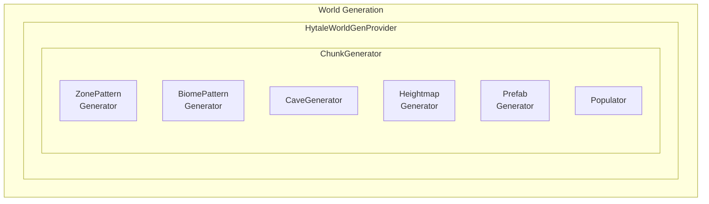

import { Aside, FileTree, Steps, Tabs, TabItem, Badge } from '@astrojs/starlight/components';

# World Generation Overview

The World Generation system creates terrain, structures, and biomes for Hytale worlds. It uses a procedural generation pipeline with zones, biomes, caves, and prefabs.

## Package Location

- Providers: `com.hypixel.hytale.server.core.universe.world.worldgen.provider`
- Hytale generator: `com.hypixel.hytale.server.worldgen`
- Generated chunks: `com.hypixel.hytale.server.core.universe.world.worldgen`
- Procedural generator: `com.hypixel.hytale.builtin.hytalegenerator`
- WorldGen modifiers: `com.hypixel.hytale.builtin.worldgen.modifier`

<Aside type="caution" title="Changed in Update 4">
Many packages within the `hytalegenerator` have been relocated:
- `newsystem/` promoted to `engine/` (all `N`-prefixed classes dropped the prefix)
- `framework/` dissolved — math utilities moved to `math/`, most other classes removed
- `seed/` renamed to `rng/` — `SeedGenerator` replaced by `RngField`
- `fields/` dissolved — noise classes moved to `noise/`, point classes to `noise/pointprovider/`
- `datastructures/voxelspace/` moved to `voxelspace/`
- `threadindexer/` renamed to `workerindexer/`
- `propassignments/` renamed to `assignments/`

All import paths have changed accordingly.
</Aside>

## Architecture



## World Gen Providers

### IWorldGenProvider Interface

```java
public interface IWorldGenProvider {
    IWorldGen getGenerator() throws WorldGenLoadException;
}
```

### HytaleWorldGenProvider

The default world generation provider for Hytale:

```java
public class HytaleWorldGenProvider implements IWorldGenProvider {
    public static final String ID = "Hytale";

    // Configuration
    String name = "Default";  // Generator name
    String path;              // Custom path (optional)
}
```

### World Config Usage

```json
{
  "WorldGen": {
    "Type": "Hytale",
    "Name": "MyWorldGen",
    "Path": "path/to/worldgen/config"
  }
}
```

### Built-in Providers

| Provider | Description |
|----------|-------------|
| `HytaleWorldGenProvider` | Full procedural terrain (in `server.worldgen` package) |
| `FlatWorldGenProvider` | Flat terrain |
| `VoidWorldGenProvider` | Empty void world |
| `DummyWorldGenProvider` | No generation |
| `HandleProvider` | Custom handle-based generator (in `builtin.hytalegenerator`) |

## ChunkGenerator

The core class that generates chunks:

```java
public class ChunkGenerator implements IBenchmarkableWorldGen, IWorldMapProvider {
    // Pool size based on CPU cores
    public static final int POOL_SIZE = Math.max(2,
        (int) Math.ceil(Runtime.getRuntime().availableProcessors() * 0.75));

    // Get zone data at coordinates
    public ZoneBiomeResult getZoneBiomeResultAt(int seed, int x, int z);

    // Get height at coordinates
    public int getHeight(int seed, int x, int z);

    // Get cave data
    public Cave getCave(CaveType caveType, int seed, int x, int z);

    // Get spawn points
    public Transform[] getSpawnPoints(int seed);
}
```

<Aside type="note" title="New in Update 3">
`HytaleGenerator` now defines `DEFAULT_SPAWN_POSITION = (0, 140, 0)` and a `getSpawnPositions(GeneratorProfile, maxPositionsCount)` method for retrieving spawn positions from world structures. Check the [Update 3 changelog](/changelog/update-2-to-3/) for all worldgen changes.
</Aside>

### Staged Chunk Generator (Engine)

<Aside type="caution" title="Changed in Update 4">
`NStagedChunkGenerator` was renamed to `StagedChunkGenerator` and moved from `newsystem/` to `engine/chunkgenerator/`. All stage classes (`NStage`, `NBiomeStage`, `NTerrainStage`, `NPropStage`, etc.) were similarly renamed (dropping the `N` prefix) and relocated to `engine/stages/`.
</Aside>

The `StagedChunkGenerator` at `com.hypixel.hytale.builtin.hytalegenerator.engine.chunkgenerator` manages chunk generation through a pipeline of `Stage` implementations:

| Stage | Description |
|-------|-------------|
| `BiomeStage` | Determines biome at each position |
| `BiomeDistanceStage` | Calculates distance to biome edges |
| `TerrainStage` | Generates terrain density and block placement |
| `PropStage` | Places props and decorations |
| `EnvironmentStage` | Applies environment settings |
| `TintStage` | Applies block tinting |

Each stage implements `Stage` with `run(Context)`, `getInputTypesAndBounds_bufferGrid()`, `getOutputTypes()`, and `getName()`.

### Generation Pipeline

1. **Zone Generation**: Determine zone at position
2. **Biome Generation**: Determine biome within zone
3. **Heightmap**: Generate terrain height
4. **Block Placement**: Place blocks based on layers
5. **Cave Carving**: Carve caves and caverns
6. **Prefab Placement**: Place structures
7. **Population**: Add details (ores, plants, etc.)

## Zones

Zones are large-scale regions of the world with distinct generation rules.

### Zone Record

```java
public record Zone(
    int id,
    String name,
    ZoneDiscoveryConfig discoveryConfig,
    CaveGenerator caveGenerator,
    BiomePatternGenerator biomePatternGenerator,
    UniquePrefabContainer uniquePrefabContainer
) {}
```

### Zone Configuration

```json
{
  "Id": 1,
  "Name": "Plains",
  "DiscoveryConfig": {
    "DiscoverKey": "zone_plains",
    "DiscoverRadius": 100
  },
  "CaveGenerator": "DefaultCaves",
  "BiomePattern": "plains_biomes.png"
}
```

### Zone Pattern Provider

Generates zone layout based on patterns:

```java
public class ZonePatternProvider {
    // Zone pattern generation
}

public class ZonePatternGenerator {
    // Generate zone at coordinates
}
```

## Biomes

<Aside type="caution" title="Changed in Update 3">
`BiomeType` was renamed to `Biome` and `SimpleBiomeType` to `SimpleBiome`. The `BiomeMap`/`SimpleBiomeMap` classes were removed and replaced by `WorldStructure`, which holds a `BiCarta<Integer>` biome map, a `Registry<Biome>`, transition distances, and spawn positions. The `Indexer` class was replaced by a typed `Registry<T>` with bidirectional lookup. The [Update 3 changelog](/changelog/update-2-to-3/) documents all renames and removals.
</Aside>

<Aside type="caution" title="Changed in Update 4">
`Biome.getBiomeName()` was removed from the interface. `SimpleBiome` now uses `PropRuntime` instead of `PropField` — `getPropFields()` became `getPropRuntimes()`, and the `PropsSource` interface method `getAllPropDistributions()` was removed in favor of `getRuntimesWithIndex(int, Consumer<PropRuntime>)`.
</Aside>

Biomes define terrain characteristics within zones.

### Biome Class

```java
public abstract class Biome {
    int id;
    String name;
    BiomeInterpolation interpolation;
    IHeightThresholdInterpreter heightmapInterpreter;

    // Containers
    CoverContainer coverContainer;       // Surface cover (grass, etc.)
    LayerContainer layerContainer;       // Block layers
    PrefabContainer prefabContainer;     // Structures
    TintContainer tintContainer;         // Color tinting
    EnvironmentContainer environmentContainer;  // Environment settings
    WaterContainer waterContainer;       // Water features
    FadeContainer fadeContainer;         // Biome transitions

    // Noise
    NoiseProperty heightmapNoise;

    // Visual
    int mapColor;
}
```

### Biome Containers

| Container | Description |
|-----------|-------------|
| `CoverContainer` | Surface blocks (grass, snow) |
| `LayerContainer` | Block layer definitions |
| `PrefabContainer` | Structure placement |
| `TintContainer` | Block tinting rules |
| `EnvironmentContainer` | Environment settings |
| `WaterContainer` | Water/fluid settings |
| `FadeContainer` | Transition rules |

### Layer Container

Defines block layers from surface to bedrock:

```json
{
  "Layers": [
    {
      "Block": "Grass",
      "Depth": 1
    },
    {
      "Block": "Dirt",
      "Depth": 3
    },
    {
      "Block": "Stone",
      "Depth": -1
    }
  ]
}
```

## Cave Generation

### CaveGenerator

```java
public class CaveGenerator {
    // Generate caves for a region
}

public enum CaveType {
    // Cave type definitions
}

public class Cave {
    // Cave data
}
```

### Cave Configuration

```json
{
  "CaveType": "Standard",
  "Frequency": 0.5,
  "MinHeight": 10,
  "MaxHeight": 64,
  "Radius": {
    "Min": 2,
    "Max": 5
  }
}
```

## Prefabs

Prefabs are pre-built structures placed during generation.

### PrefabContainer

```java
public class PrefabContainer {
    // Prefab placement rules
}

public class PrefabLoadingCache {
    // Cache for loaded prefabs
}
```

### Prefab Configuration

```json
{
  "Prefabs": [
    {
      "Id": "Village_House",
      "Chance": 0.1,
      "MinDistance": 100,
      "GroundLevel": "Surface"
    }
  ]
}
```

### Unique Prefabs

Special one-per-world prefabs:

```java
public class UniquePrefabContainer {
    // Unique prefab management

    public static class UniquePrefabEntry {
        boolean isSpawnLocation();
        Vector3i getPosition();
        Vector3d getSpawnOffset();
        Rotation getRotation();
    }
}
```

## Props

<Aside type="note" title="New in Update 2">
`WeightedProp` and `OffsetProp` were added in Update 2 for more flexible world generation.
</Aside>

<Aside type="caution" title="Changed in Update 4">
The `Prop` API has been completely rewritten. The two-phase `scan()`/`place()` pattern was replaced by a single `boolean generate(Prop.Context)` method. `Prop.noProp()` was replaced by `EmptyProp.INSTANCE`. The `Prop.Context` fields changed: `ScanResult scanResult` became `Vector3i position`, `VoxelSpace<Material> materialSpace` was split into `materialReadSpace` and `materialWriteSpace`, `EntityContainer entityBuffer` became `EntityFunnel entityWriteBuffer`, and `distanceFromBiomeEdge` was renamed to `distanceToBiomeEdge`.
</Aside>

Props are decorative elements placed during world generation.

### Prop API (v4)

```java
public abstract class Prop {
    public abstract boolean generate(Prop.Context context);
    public abstract Bounds3i getReadBounds_voxelGrid();
    public abstract Bounds3i getWriteBounds_voxelGrid();

    public static class Context {
        public Vector3i position;
        public VoxelSpace<Material> materialReadSpace;
        public VoxelSpace<Material> materialWriteSpace;
        public EntityFunnel entityWriteBuffer;
        public double distanceToBiomeEdge;
    }
}
```

### New Prop Types

<Aside type="note" title="New in Update 4">
Several new prop types were added: `CuboidProp`, `DensitySelectorProp`, `EmptyProp`, `LocatorProp`, `ManualProp`, `MaskProp`, `OrienterProp`, `PrefabProp`, `PondFillerProp`, and `StaticRotatorProp`. Many v3 prop types (`BoxProp`, `ClusterProp`, `ColumnProp`, and others) were moved to `props/deprecated/`.
</Aside>

| Prop | Description |
|------|-------------|
| `CuboidProp` | Cuboid generation |
| `DensityProp` | Density-based block placement (rewritten in v4) |
| `DensitySelectorProp` | Density-based prop selection |
| `EmptyProp` | No-op singleton (`EmptyProp.INSTANCE`) |
| `LocatorProp` | Locator-based placement |
| `ManualProp` | Manual block placement |
| `MaskProp` | Masking support |
| `OffsetProp` | Position offset applied to child prop |
| `OrienterProp` | Orientation handling |
| `PrefabProp` | Prefab structure placement |
| `PondFillerProp` | Pond filling |
| `QueueProp` | Queued prop execution |
| `StaticRotatorProp` | Static rotation |
| `UnionProp` | Union of multiple props |
| `WeightedProp` | Weight-based random selection |

### WeightedProp

Selects a child prop randomly based on weight probability:

```java
public class WeightedProp extends Prop {
    private final WeightedMap<Prop> props;
}
```

**Configuration**:

```json title="Weighted prop example"
{
  "Type": "Weighted",
  "Entries": [
    { "Prop": "Tree_Oak_Large", "Weight": 0.1 },
    { "Prop": "Tree_Oak_Medium", "Weight": 0.3 },
    { "Prop": "Tree_Oak_Small", "Weight": 0.6 }
  ]
}
```

| Field | Type | Description |
|-------|------|-------------|
| `Entries` | `array` | List of weighted prop entries |
| `Entries[].Prop` | `string` | Prop ID to place |
| `Entries[].Weight` | `float` | Relative weight (higher = more likely) |

**Use Cases**:
- Varied tree sizes (mostly small, occasionally large)
- Rock formations with random sizes
- Flower variety in meadows

### OffsetProp

Applies a position offset to a child prop:

```java
public class OffsetProp extends Prop {
    private final Vector3i offset;
    private final Prop childProp;
}
```

**Configuration**:

```json title="Offset prop example"
{
  "Type": "Offset",
  "Prop": "Mushroom_Cluster",
  "Offset": { "X": 0, "Y": -1, "Z": 0 }
}
```

| Field | Type | Description |
|-------|------|-------------|
| `Prop` | `string` | Child prop ID |
| `Offset` | `Vector3i` | Position offset to apply |

**Use Cases**:
- Partially buried objects
- Floating elements (vines, hanging plants)
- Stacked prop combinations

### SimpleHorizontalPositionProvider

<Aside type="caution">
`VerticalEliminatorPositionProvider` was renamed to `SimpleHorizontalPositionProvider` in Update 2.
</Aside>

<Aside type="caution" title="Changed in Update 3">
`SpherePositionProviderAsset` / `SpherePositionProvider` were removed and replaced by `BoundPositionProviderAsset` / `BoundPositionProvider`, which use axis-aligned 3D bounds instead of spherical distance filtering. A new `FrameworkPositionProviderAsset` was also added for referencing named positions from the `PositionsFrameworkAsset`. See the [Update 3 changelog](/changelog/update-2-to-3/) for all position provider changes.
</Aside>

Provides horizontal positions for prop placement:

```java
public class SimpleHorizontalPositionProvider implements PositionProvider {
    // Generates horizontal positions within a region
}
```

**Configuration**:

```json title="Position provider example"
{
  "Type": "SimpleHorizontal",
  "Density": 0.1,
  "MinSpacing": 2.0,
  "MaxSpacing": 8.0
}
```

## Scanners

<Aside type="caution" title="Changed in Update 4">
The `Scanner` API now uses a pipe-based pattern. The old `List<Vector3i> scan(Context)` method is deprecated in favor of `void scan(Vector3i, Pipe.One<Vector3i>)`. `SpaceSize scanSpace()` became `Bounds3i getBounds_voxelGrid()`. `Scanner.noScanner()` was replaced by `EmptyScanner`. `OriginScanner` was replaced by `DirectScanner`.
</Aside>

Scanners find valid positions for prop placement within a region.

```java
public abstract class Scanner {
    @Deprecated
    public abstract void scan(Scanner.Context context);

    public abstract void scan(Vector3i position, Pipe.One<Vector3i> pipe);

    public abstract Bounds3i getBounds_voxelGrid();

    public Bounds3i getBoundsWithPattern_voxelGrid(Pattern pattern);
}
```

| Scanner | Description |
|---------|-------------|
| `DirectScanner` | Direct position scanning (replaces `OriginScanner`) |
| `EmptyScanner` | No-op singleton |
| `LinearScanner` | Linear scanning pattern |
| `QueueScanner` | Queue-based scanning |
| `RadialScanner` | Radial scanning pattern |
| `RandomScanner` | Random position scanning |

## Position Providers

<Aside type="caution" title="Changed in Update 4">
`PositionProvider.positionsIn(Context)` was renamed to `generate(Context)`. The `Context` fields changed: `Vector3d minInclusive`/`maxExclusive` became `Bounds3d bounds`, and `Consumer<Vector3d> consumer` became `Pipe.One<Vector3d> pipe`. `PositionProvider.noPositionProvider()` was replaced by `EmptyPositionProvider.INSTANCE`. `Mesh2DPositionProvider` and `Mesh3DPositionProvider` were moved to `positionproviders/deprecated/`.
</Aside>

Position providers generate candidate positions for prop distribution.

```java
public abstract class PositionProvider {
    public abstract void generate(PositionProvider.Context context);

    public static class Context {
        public Bounds3d bounds;
        public Pipe.One<Vector3d> pipe;
        public Vector3d anchor;
    }
}
```

<Aside type="note" title="New in Update 4">
New position provider types: `ClustersPositionProvider`, `EmptyPositionProvider`, `Jitter2dPositionProvider`, `Jitter3dPositionProvider`, `ScalerPositionProvider`, `SquareGrid2dPositionProvider`, `SquareGrid3dPositionProvider`, and `TriangularGrid2dPositionProvider`.
</Aside>

## Pipe System

<Aside type="note" title="New in Update 4">
The `Pipe` system at `com.hypixel.hytale.builtin.hytalegenerator.pipe` replaces raw `Consumer<T>` usage throughout the generation pipeline. It provides flow control via a `Control` object that can halt iteration mid-stream.
</Aside>

```java
public class Pipe {
    @FunctionalInterface
    public interface One<Input> {
        void accept(Input input, Control control);
    }

    @FunctionalInterface
    public interface Two<InputA, InputB> {
        void accept(InputA a, InputB b, Control control);
    }
}

public class Control {
    public boolean stop = false;
    public void reset();
}
```

Setting `control.stop = true` within a pipe callback signals the caller to stop iterating, allowing early termination of position or prop generation.

## Prop Distribution System

<Aside type="note" title="New in Update 4">
The `PropDistribution` system replaces the old `PropField` class. `PropRuntime` binds a `PropDistribution` with a runtime index (replacing `PropField` which stored a `PositionProvider` + `Assignments`). The `PropsSource` interface now exposes `getPropRuntimes()` and `getRuntimesWithIndex(int, Consumer<PropRuntime>)`.
</Aside>

Prop distributions manage how props are selected and positioned within biomes.

| Distribution | Description |
|-------------|-------------|
| `AssignedPropDistribution` | Distribution with prop assignments |
| `ConstantPropDistribution` | Constant prop distribution |
| `NoPropDistribution` | No-op distribution |
| `PositionsPropDistribution` | Position-based distribution |
| `UnionPropDistribution` | Union of multiple distributions |

## VoxelSpace

<Aside type="caution" title="Changed in Update 4">
`VoxelSpace` was moved from `datastructures/voxelspace/` to `voxelspace/`. The API was renamed: `getContent(pos)` became `get(pos)`, `setContent(val, pos)` became `set(val, pos)`, and `isInsideSpace(pos)` became `getBounds().contains(pos)`. New methods `setAll(T)` and `getBounds()` were added. `BooleanVoxelSpace` was replaced by `MaskVoxelSpace`. A new `RotationVoxelSpace` was added for rotation-aware voxel access.
</Aside>

```java
public interface VoxelSpace<T> {
    void set(T value, int x, int y, int z);
    void set(T value, Vector3i pos);
    void setAll(T value);
    T get(int x, int y, int z);
    T get(Vector3i pos);
    Bounds3i getBounds();
}
```

| Implementation | Description |
|---------------|-------------|
| `ArrayVoxelSpace` | Array-backed storage |
| `MaskVoxelSpace` | Boolean mask (replaces `BooleanVoxelSpace`) |
| `NullSpace` | Null-pattern implementation |
| `RotationVoxelSpace` | Rotation-aware access |
| `WindowVoxelSpace` | Windowed view into another space |

## RNG System

<Aside type="caution" title="Changed in Update 4">
The `seed/` package was renamed to `rng/`. `SeedGenerator` was removed and replaced by `RngField`, which provides position-seeded deterministic random numbers via bit manipulation. `SeedBox` was relocated to `rng/SeedBox`.
</Aside>

The RNG system at `com.hypixel.hytale.builtin.hytalegenerator.rng` provides deterministic random number generation for world generation.

| Class | Description |
|-------|-------------|
| `Rng` | Static utility with `getRandomInt(seed, key)`, `mix(seed, a, b)`, `splitMixLong(n)` |
| `RngField` | Position-seeded RNG field with `get(x, y, z)` and `get(x, y)` |
| `SeedBox` | Seed container (relocated from `seed/`) |

## Patterns

<Aside type="caution" title="Changed in Update 4">
`Pattern.readSpace()` was renamed to `getBounds_voxelGrid()` returning `Bounds3i` instead of `SpaceSize`. `Pattern.noPattern()` was replaced by `ConstantPattern.INSTANCE_FALSE` and `Pattern.yesPattern()` by `ConstantPattern.INSTANCE_TRUE`. `GapPattern` was removed and replaced by `RotatorPattern`.
</Aside>

## WorldGen Modifier System

<Aside type="note" title="New in Update 4">
The WorldGen Modifier system at `com.hypixel.hytale.builtin.worldgen.modifier` is a data-driven API for modifying world generation configurations without replacing them entirely. Modifiers are loaded as assets at the path `WorldGen/Modifier`.
</Aside>

Modifiers target specific world-gen configurations and apply operations (add/remove) to biome and cave content lists. This allows plugins to inject or remove biome covers, layers, prefabs, tints, cave types, and more.

### WorldGenModifier Asset

```java
public class WorldGenModifier {
    protected String id;
    protected EventPriority priority;
    protected Target target;
    protected Map<EventType, Op[]> content;
}
```

| Field | Type | Description |
|-------|------|-------------|
| `Priority` | `EventPriority` | Order relative to other modifiers |
| `Target` | `Target` | Which world-gen configuration to modify |
| `Content` | `Map<EventType, Op[]>` | Operations to apply per event type |

### Target

```java
public class Target {
    private String root = "Default";
    private String[] rules;
}
```

- `Root`: the world-gen root configuration folder name to target
- `Rules`: glob patterns to match asset file paths within the root

### Event Types

| Event Type | Description |
|-----------|-------------|
| `Biome_Covers` | Surface cover blocks |
| `Biome_Environments` | Environment settings |
| `Biome_Fluids` | Fluid configurations |
| `Biome_Dynamic_Layers` | Dynamic block layers |
| `Biome_Static_Layers` | Static block layers |
| `Biome_Prefabs` | Structure placement |
| `Biome_Tints` | Block tinting |
| `Cave_Types` | Cave type definitions |
| `Cave_Covers` | Cave surface covers |
| `Cave_Prefabs` | Cave structure placement |

### Operations

Two built-in operations are available:

- **`Add`**: adds content to the target list via a `Content` reference (file path or inline JSON)
- **`Remove`**: removes entries matching glob `Rules`. Supports `"*"` to clear all entries. Glob matching is implemented for prefab paths and cave type names.

### Example Configuration

```json title="WorldGen modifier example"
{
  "Priority": "NORMAL",
  "Target": {
    "Root": "Default",
    "Rules": ["Biomes/Plains/*"]
  },
  "Content": {
    "Biome_Prefabs": [
      {
        "Operation": "Add",
        "Content": {
          "Type": "File",
          "Path": "MyPlugin.Prefabs.CustomTree"
        }
      }
    ]
  }
}
```

### Event Handling

The `EventHandler` is scoped per thread and acquired for a root configuration path. It collects all matching modifiers, sorts them by priority and asset pack order, and dispatches operations against `ModifyEvent` instances during asset loading.

## Entity Funnel

<Aside type="note" title="New in Update 4">
`EntityFunnel` at `com.hypixel.hytale.builtin.hytalegenerator.engine.entityfunnel` replaces direct `EntityContainer` usage in the prop pipeline. It provides `addEntity(EntityPlacementData)` and `getBounds()`. A `RotationEntityFunnel` variant applies rotation transforms to entity offsets.
</Aside>

## Populators

Populators add details after basic terrain is generated.

### Built-in Populators

| Populator | Description |
|-----------|-------------|
| `BlockPopulator` | Place additional blocks |
| `CavePopulator` | Carve caves |
| `WaterPopulator` | Add water features |
| `PrefabPopulator` | Place structures |

### Populator Interface

```java
public interface IPopulator {
    void populate(GeneratedChunk chunk, Random random);
}
```

## Generated Chunk

The output of chunk generation:

```java
public class GeneratedChunk {
    // Block data
    GeneratedBlockChunk blockChunk;

    // Block states
    GeneratedBlockStateChunk blockStateChunk;

    // Entities
    GeneratedEntityChunk entityChunk;
}
```

## Noise Functions

<Aside type="caution" title="Changed in Update 4">
The `fields/` package was dissolved. `CellNoiseField`, `NoiseField`, `Simplex`, `SimplexNoiseField`, and `FastNoiseLite` moved to `noise/`. `JitterPointField`, `PointField`, and `PointProvider` moved to `noise/pointprovider/`.
</Aside>

World generation uses noise for natural variation.

### NoiseProperty

```java
public class NoiseProperty {
    // Noise configuration
}
```

### Height Threshold Interpreter

```java
public interface IHeightThresholdInterpreter {
    // Interpret height thresholds for biome-specific terrain
}
```

## Procedural Library

The procedural library provides tools for generation:

### Conditions

```java
// Height-based conditions
IHeightThresholdInterpreter

// Block-based conditions
HashSetBlockFluidCondition
FilteredBlockFluidCondition
BlockMaskCondition
```

### Property Suppliers

```java
ICoordinateDoubleSupplier
ConstantCoordinateDoubleSupplier
RandomCoordinateDoubleSupplier
```

## World Bounds

```java
public interface IWorldBounds {
    int getMinX();
    int getMaxX();
    int getMinZ();
    int getMaxZ();
}

public interface IChunkBounds {
    int getMinChunkX();
    int getMaxChunkX();
    int getMinChunkZ();
    int getMaxChunkZ();
}
```

## Caching

World generation uses extensive caching:

```java
public class ChunkGeneratorCache {
    // Cache zone/biome results
    // Cache heights
    // Cache interpolated values
}

public class CaveGeneratorCache {
    // Cache cave data
}

public class PrefabLoadingCache {
    // Cache loaded prefabs
}
```

## Configuration Files

### World.json

Main world generation configuration:

```json
{
  "Zones": "zones/",
  "DefaultZone": "Plains",
  "SeaLevel": 64,
  "WorldHeight": 256,
  "Caves": {
    "Enabled": true,
    "Types": ["Standard", "Cavern"]
  }
}
```

### Zone Configuration

Each zone has its own configuration:

<FileTree>
- worldgen/
  - World.json
  - zones/
    - Plains/
      - zone.json
      - biomes/
        - Grassland.json
        - Forest.json
    - Mountains/
      - zone.json
      - biomes/
        - Alpine.json
  - prefabs/
    - village/
    - dungeons/
</FileTree>

## Custom World Generation

### Implementing IWorldGenProvider

```java
public class MyWorldGenProvider implements IWorldGenProvider {
    public static final BuilderCodec<MyWorldGenProvider> CODEC =
        BuilderCodec.builder(MyWorldGenProvider.class, MyWorldGenProvider::new)
            // Add configuration fields
            .build();

    @Override
    public IWorldGen getGenerator() throws WorldGenLoadException {
        return new MyChunkGenerator();
    }
}
```

### Registering Provider

```java
@Override
protected void setup() {
    IWorldGenProvider.CODEC.register(
        Priority.DEFAULT,
        "MyPlugin_WorldGen",
        MyWorldGenProvider.class,
        MyWorldGenProvider.CODEC
    );
}
```

## Timings and Metrics

```java
public class WorldGenTimingsCollector {
    // Collect generation timings
}

// ChunkGenerator implements MetricProvider
public interface MetricProvider {
    MetricResults getMetrics();
}
```

## Best Practices

1. **Use caching**: Leverage built-in caches for performance
2. **Async generation**: Use thread pool for heavy operations
3. **Seed consistency**: Ensure deterministic generation from seed
4. **Validate output**: Use `ValidatableWorldGen` interface
5. **Profile performance**: Use benchmarking tools
6. **Modular design**: Separate zones, biomes, and populators

## Related

- [World System](/plugin-development/world/overview/) - World management
- [Block System](/plugin-development/blocks/overview/) - Block types
- [Asset System](/asset-development/overview/) - Prefab assets

{/* [VERIFIED: 2026-03-21] [FIXES: VAL-4, VAL-5, VAL-6, VAL-7] */}
